[Содержание](#Содержание)
==========

- [Паттерны программирования](#Паттерны-программирования)
    - [Принципы паттернов](#Принципы-паттернов)
        - [Основной принцип построения паттернов](#Основной-принцип-построения-паттернов)
        - [Принцип проектирования: предпочтение композиции перед наследованием](#Принцип-проектирования-предпочтение-композиции-перед-наследованием)
        - [Принцип инверсии зависимостей](#Принцип-инверсии-зависимостей)
        - [Принцип минимальной информированости](#Принцип-минимальной-информированости)
        - [Голливудский принцип](#Голливудский-принцип)
        - [Принцип одной обязанности](#Принцип-одной-обязанности)
    - [Паттерны](#Паттерны)
        - [Порождающие шаблоны проектирования](#Порождающие-шаблоны-проектирования)
            - [Паттерн Простая Фабрика (Factory)](#Паттерн-Простая-Фабрика-Factory)
            - [Паттерн Фабричный Метод (Factory method)](#Паттерн-Фабричный-Метод-Factory-method)
            - [Паттерн Абстрактная фабрика (Abstract factory)](#Паттерн-Абстрактная-фабрика-Abstract-factory)
            - [Паттерн Строитель (Builder)](#Паттерн-Строитель-Builder)
            - [Паттерн Прототип (Prototype)](#Паттерн-Прототип-Prototype)
            - [Паттерн Одиночка (Singleton)](#Паттерн-Одиночка-Singleton)
        - [Структурные шаблоны проектирования](#Структурные-шаблоны-проектирования)
            - [Паттерн Адаптер (Adapter)](#Паттерн-Адаптер-Adapter)
            - [Паттерн Мост (Bridge)](#Паттерн-Мост-Bridge)
            - [Паттерн Компоновщик (Composite)](#Паттерн-Компоновщик-Composite)
            - [Паттерн Декоратор (Decorator)](#Паттерн-Декоратор-Decorator)
            - [Паттерн Фасад (Facade)](#Паттерн-Фасад-Facade)
            - [Паттерн Приспособленец (Flyweight)](#Паттерн-Приспособленец-Flyweight)
            - [Паттерн Заместитель (Proxy)](#Паттерн-Заместитель-Proxy)
        - [Поведенческие шаблоны проектирования](#Поведенческие-шаблоны-проектирования)
            - [Паттерн Цепочка обязанностей (Chain of responsibility)](#Паттерн-Цепочка-обязанностей-Chain-of-responsibility)
            - [Паттерн Команда (Command)](#Паттерн-Команда-Command)
            - [Паттерн Интерпретатор (Interpreter)](#Паттерн-Интерпретатор-Interpreter)
            - [Паттерн Итератор (Iterator)](#Паттерн-Итератор-Iterator)
            - [Паттерн Посредник (Mediator)](#Паттерн-Посредник-Mediator)
            - [Паттерн Хранитель (Memento)](#Паттерн-Хранитель-Memento)
            - [Паттерн Наблюдатель (Observer)](#Паттерн-Наблюдатель-Observer)
            - [Паттерн Посетитель (Visitor)](#Паттерн-Посетитель-Visitor)
        - [Паттерн Стратегия (Strategy)](#Паттерн-Стратегия-Strategy)
        - [Паттерн Состояние (State)](#Паттерн-Состояние-State)
        - [Паттерн Шаблонный метод (Template method)](#Паттерн-Шаблонный-метод-Template-method)
    - [Составные паттерны](#Составные-паттерны)
        - [Паттерн Модель-Представление-Контроллер](#Паттерн-Модель-Представление-Контроллер)
- [Принципы проектирования](#Принципы-проектирования)
    - [SOLID](#SOLID)
        - [Принцип единственной ответственности (Single Responsibility Principle, SRP)](#Принцип-единственной-ответственности-Single-Responsibility-Principle-SRP)
        - [Принцип открытости/закрытости (Open/Closed Principle, OCP)](#Принцип-открытостизакрытости-OpenClosed-Principle-OCP)
        - [Принцип подстановки Барбары Лисков (Liskov Substitution Principle, LSP)](#Принцип-подстановки-Барбары-Лисков-Liskov-Substitution-Principle-LSP)
        - [Принцип разделения интерфейса (Interface Segregation Principle, ISP)](#Принцип-разделения-интерфейса-Interface-Segregation-Principle-ISP)
        - [Принцип инверсии зависимостей (Dependency Inversion Principle, DIP)](#Принцип-инверсии-зависимостей-Dependency-Inversion-Principle-DIP)
    - [KISS (Keep it short and simple)](#KISS-Keep-it-short-and-simple)
    - [Чем хуже, тем лучше](#Чем-хуже-тем-лучше)
    - [DRY (Don’t repeat yourself)](#DRY-Dont-repeat-yourself)
    - [YAGNI (You ain't gonna need it)](#YAGNI-You-aint-gonna-need-it)
    - [GIGO (Garbage In, Garbage Out)](#GIGO-Garbage-In-Garbage-Out)
- [REST](#REST)
    - [HTTP методы](#HTTP-методы)
        - [Метод **GET**](#Метод-GET)
        - [Метод **PUT**](#Метод-PUT)
        - [Метод **POST**](#Метод-POST)
        - [Метод **DELETE**](#Метод-DELETE)
    - [Именование ресурсов](#Именование-ресурсов)
        - [Наименование ресурса](#Наименование-ресурса)
        - [Взаимодействие с подресурсом ресурса](#Взаимодействие-с-подресурсом-ресурса)
    - [Идемпотентность](#Идемпотентность)
    - [Безопасность](#Безопасность)
- [Рекомендации по проектированию HTTP API](#Рекомендации-по-проектированию-HTTP-API)
    - [Основные принципы](#Основные-принципы)
        - [Принцип разделения ответственности](#Принцип-разделения-ответственности)
        - [Требование использования защищенных соединений](#Требование-использования-защищенных-соединений)
        - [Требование наличие версии в заголовке `Accept`](#Требование-наличие-версии-в-заголовке-Accept)
        - [Использовать заголовок `ETags` для кеширования](#Использовать-заголовок-ETags-для-кеширования)
        - [Использовать `Request-ID` для интроспекции](#Использовать-Request-ID-для-интроспекции)
        - [Необходимо разбивать большие ответы сервера на несколько небольших при помощи заголовка `Range`](#Необходимо-разбивать-большие-ответы-сервера-на-несколько-небольших-при-помощи-заголовка-Range)
    - [Запросы](#Запросы)
        - [Соответствующие коды состояний](#Соответствующие-коды-состояний)
        - [Предоставление полных версии ресурсов](#Предоставление-полных-версии-ресурсов)
        - [API должен принимать сериализованный JSON в теле запроса](#API-должен-принимать-сериализованный-JSON-в-теле-запроса)
    - [Конструировании пути к ресурсу](#Конструировании-пути-к-ресурсу)
        - [Названия ресурсов](#Названия-ресурсов)
        - [Действия](#Действия)
        - [Названия компонентов пути и атрибутов](#Названия-компонентов-пути-и-атрибутов)
        - [API должен поддерживать доступ к ресурсу не только по его id](#API-должен-поддерживать-доступ-к-ресурсу-не-только-по-его-id)
        - [Необходимо свести к минимуму количество вложений в пути для доступа к ресурсу](#Необходимо-свести-к-минимуму-количество-вложений-в-пути-для-доступа-к-ресурсу)
    - [Ответы](#Ответы)
        - [Необходимо предоставлять UUID запрашиваемых ресурсов](#Необходимо-предоставлять-UUID-запрашиваемых-ресурсов)
        - [Необходимо предоставлять информацию о дате создания и изменения ресурса](#Необходимо-предоставлять-информацию-о-дате-создания-и-изменения-ресурса)
        - [Временные величины должны быть форматированы согласно ISO8601](#Временные-величины-должны-быть-форматированы-согласно-ISO8601)
        - [Отношения с внешними сущностями должны быть вынесены во вложенный объект](#Отношения-с-внешними-сущностями-должны-быть-вынесены-во-вложенный-объект)
        - [Необходимо создавать структурированные ответы в случае возникновения ошибок](#Необходимо-создавать-структурированные-ответы-в-случае-возникновения-ошибок)
        - [Необходимо показывайть ограничение по количеству запросов](#Необходимо-показывайть-ограничение-по-количеству-запросов)
        - [JSON во всех ответах должен быть минимизирован](#JSON-во-всех-ответах-должен-быть-минимизирован)
    - [Артефакты](#Артефакты)
        - [Необходимо предоставлять удобную для обработки JSON-схему](#Необходимо-предоставлять-удобную-для-обработки-JSON-схему)
        - [Необходимо предоставлять удобочитаемую документацию](#Необходимо-предоставлять-удобочитаемую-документацию)
        - [Необходимо предоставлять примеры запросов, которые можно протестировать](#Необходимо-предоставлять-примеры-запросов-которые-можно-протестировать)
        - [Стабильность API](#Стабильность-API)
- [Коды состояния HTTP](#Коды-состояния-HTTP)
    - [**1xx: Informational** (информационные)](#1xx-Informational-информационные)
    - [**2xx: Success** (успешно)](#2xx-Success-успешно)
    - [**3xx: Redirection** (перенаправление)](#3xx-Redirection-перенаправление)
    - [**4xx: Client Error** (ошибка клиента)](#4xx-Client-Error-ошибка-клиента)
    - [**5xx: Server Error** (ошибка сервера)](#5xx-Server-Error-ошибка-сервера)
- [HTTP Авторизация](#HTTP-Авторизация)
- [Масштабирование приложений](#Масштабирование-приложений)
    - [Доступность](#Доступность)
        - [Измерение доступности](#Измерение-доступности)
        - [Автоматизация ручных процессов](#Автоматизация-ручных-процессов)
    - [Управление рисками](#Управление-рисками)
        - [Принципы управления рисками](#Принципы-управления-рисками)
        - [Матрица рисков](#Матрица-рисков)
        - [Смягчение рисков](#Смягчение-рисков)
        - [Избыточность](#Избыточность)
        - [Сложность](#Сложность)
        - [Самовосстановление](#Самовосстановление)
    - [Сервисы и микросервисы](#Сервисы-и-микросервисы)
        - [Обработка отказов сервисов](#Обработка-отказов-сервисов)

<a id="Паттерны-программирования" href="#Паттерны-программирования">Паттерны программирования</a> [<a id="Содержание" href="#Содержание">Содержание</a>]
=========================

**Паттерн** - решение задачи в контексте.

Где:
- **Контекстом** называется ситуация, в которой применяется паттерн. Ситуация должна быть достаточно типичной и распространенной;
- **Задачей** называется цель, которой вы хотите добиться в контексте, в совокупности со всеми ограничениями, присущими контексту;
- **Решением** называется обобщенная архитектура, которая достигает заданной цели при соблюдении набора ограничений.

## <a id="Принципы-паттернов" href="#Принципы-паттернов">Принципы паттернов</a> [<a id="Содержание" href="#Содержание">Содержание</a>]

### <a id="Основной-принцип-построения-паттернов" href="#Основной-принцип-построения-паттернов">Основной принцип построения паттернов</a> [<a id="Содержание" href="#Содержание">Содержание</a>]

**Основной принцип построения паттернов** - если некий аспект кода изменяется (допустим, с введением новых требований), то его необходимо отделить от тех аспектов, которые остаются неизменными - выделить переменные составляющие и инкапсулировать их, чтобы позднее их можно было изменять или расширять без воздействия на постоянные составляющие - **инкапсулировать то что изменяется**.

Все паттерны обеспечивают возможность изменения некоторой части системы независимо от других частей.

### <a id="Принцип-проектирования-предпочтение-композиции-перед-наследованием" href="#Принцип-проектирования-предпочтение-композиции-перед-наследованием">Принцип проектирования: предпочтение композиции перед наследованием</a> [<a id="Содержание" href="#Содержание">Содержание</a>]

**Принцип проектирования**: отдавать предпочтение композиции перед наследованием, то есть делегирование соответствующих операций (поведения) другим объектам, что позволяет делать системы более гибче и изменять поведение во время выполнения - при условии, что объект, подключенный посредством композиции, реализует правильный интерфейс.

Если два объекта могут взаимодействовать, не обладая практически никакой информацией друг о друге, такие объекты называют **слабосвязанными**. На базе слабосвязанных архитектур строятся гибкие ОО-системы, которые хорошо адаптируются к изменениям благодаря минимальным зависимостям между объектами.

Необходимо стремиться к слабой связанности взаимодействующих объектов.

Классы должны быть открыты для расширения, но закрыты для изменения - это дает архитектуры, устойчивые к изменениям и достаточно гибкие для поддержки новой функциональности в соответствии с изменившимися требованиями.

### <a id="Принцип-инверсии-зависимостей" href="#Принцип-инверсии-зависимостей">Принцип инверсии зависимостей</a> [<a id="Содержание" href="#Содержание">Содержание</a>]

**Принцип инверсии зависимостей** - код должен зависеть от абстракций, а не от конкретных классов. Он требует, чтобы высокоуровневые компоненты не зависели от низкоуровневых компонентов; вместо этого и те, и другие должны зависеть от абстракций.  
"*Высокоуровневым*" компонентом называется класс, поведение которого определяется в контексте других, "*низкоуровневых*" компонентов.

Рекомендации для избегания нарушения принципа инверсии зависимостей в архитектурах:
- ссылки на конкретные классы не должны храниться в переменных;
- в архитектуре не должно быть классов, производных от конкретных классов;
- методы не должны переопределять методы, реализованные в каких-либо из его базовых классов.

### <a id="Принцип-минимальной-информированости" href="#Принцип-минимальной-информированости">Принцип минимальной информированости</a> [<a id="Содержание" href="#Содержание">Содержание</a>]

**Принцип минимальной информированости** - сокращение взаимодействия между объектами до несколький ближайших объектов. Это препятствует созданию архитектур с большим количеством тесно связанных классов, в которых изменение в одной части системы каскадно распространяется в другие части. При формировании многочисленных зависимостей между классами система теряет гибкость и становится сложной для понимания, а затраты на ее сопровождение возрастают.

Согласно принципу, из любого метода этого объекта должны вызываться только методы, принадлежащие:
- самому объекту;
- объектам, переданным в параметрах метода;
- любому объекту, созданному внутри метода.

То есть запрещают вызывать методы для объектов полученых в результате вызова других методов.

И любым компонентам объекта - любым объектам, на которые ссылается переменная экземпляра (связаны отношением типа содержит).

### <a id="Голливудский-принцип" href="#Голливудский-принцип">Голливудский принцип</a> [<a id="Содержание" href="#Содержание">Содержание</a>]

**Голливудский принцип** - позволяет компонентам низкого уровня подключаться к системе, но компоненты высокого уровня сами определяют, когда и как они должны использоваться. Иначе говоря, компоненты высокого уровня запрещают компонентам низкого уровня "проявлять инициативу".

Этот принцип помогает предотвратить "разложение зависимостей" - явление, при котором компоненты высокого уровня зависят от компонентов низкого уровня, которые зависят от компонентов низкого уровня, которые зависят... и т. д. Разобраться в архитектуре такой системы очень трудно.

### <a id="Принцип-одной-обязанности" href="#Принцип-одной-обязанности">Принцип одной обязанности</a> [<a id="Содержание" href="#Содержание">Содержание</a>]

**Принцип одной обязанности** - класс должен иметь только одну причину для изменения. То есть изменений в классах следует по возможности избегать, так как модификация кода обычно сопровождается массой проблем. Наличие двух причин для изменения повышает вероятность того, что класс изменится в будущем, а если это все же произойдет - изменения повлияют на два аспекта архитектуры.

Принцип указывает на то, что каждому классу должна быть выделена одна - и только одна! - обязанность. Каждая обязанность класса является областью потенциальных изменений. Несколько обязанностей несколько причин для изменения. Принцип рекомендует ограничить каждый класс одной обязанностью.

## <a id="Паттерны" href="#Паттерны">Паттерны</a> [<a id="Содержание" href="#Содержание">Содержание</a>]

### <a id="Порождающие-шаблоны-проектирования" href="#Порождающие-шаблоны-проектирования">Порождающие шаблоны проектирования</a> [<a id="Содержание" href="#Содержание">Содержание</a>]

*Порождающие шаблоны описывают создание (instantiate) объекта или группы связанных объектов.*

Это шаблоны, которые используют механизмы создания объектов, чтобы создавать объекты подходящим для данной ситуации способом. Базовый способ создания может привести к проблемам в архитектуре или к её усложнению. Порождающие шаблоны пытаются решать эти проблемы, управляя способом создания объектов.

#### <a id="Паттерн-Простая-Фабрика-Factory" href="#Паттерн-Простая-Фабрика-Factory">Паттерн Простая Фабрика (Factory)</a> [<a id="Содержание" href="#Содержание">Содержание</a>]

*Простая фабрика просто генерирует экземпляр для клиента без предоставления какой-либо логики экземпляра.*

В объектно ориентированном программировании фабрикой называется объект, создающий другие объекты. Формально фабрика - это функция или метод, возвращающая объекты разных прототипов или классов из вызова какого-то метода, который считается новым.

**Использование**

Когда создание объекта подразумевает какую-то логику, а не просто несколько присваиваний, то имеет смысл делегировать задачу выделенной фабрике, а не повторять повсюду один и тот же код.

[Пример паттерна Простая Фабрика](../assets/Patterns/Factory.js)

#### <a id="Паттерн-Фабричный-Метод-Factory-method" href="#Паттерн-Фабричный-Метод-Factory-method">Паттерн Фабричный Метод (Factory method)</a> [<a id="Содержание" href="#Содержание">Содержание</a>]

*Это способ делегирования логики создания объектов (instantiation logic) дочерним классам.*

В классо-ориентированном программировании (class-based programming) фабричным методом называют порождающий шаблон проектирования, использующий генерирующие методы (factory method) для решения проблемы создания объектов без указания для них конкретных классов. Объекты создаются посредством вызова не конструктора, а генерирующего метода, определённого в интерфейсе и реализованного дочерними классами либо реализованного в базовом классе и, опционально, переопределённого (overridden) производными классами (derived classes).

**Назначение**

Определяет интерфейс для создания объекта, но оставляет подклассам решение о том, какой класс инстанцировать. Фабричный метод позволяет классу делегировать инстанцирование подклассам.

**Применимость**:
- когда классу заранее неизвестно, объекты каких классов ему нужно создавать;
- когда класс спроектирован так, чтобы объекты, которые он создает, специфицировались подклассами;
- когда класс делегирует свои обязанности одному из нескольких вспомогательных подклассов, и вы планируете локализовать знание о том, какой класс принимает эти обязанности на себя.

**Изображение**

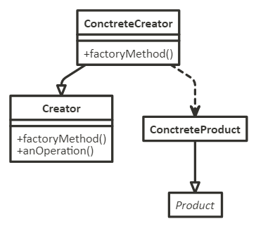

**Участники**:
- `Product` - продукт:
    - определяет интерфейс объектов, создаваемых фабричным методом;
- `ConcreteProduct` - конкретный продукт:
    - реализует интерфейс `Product`;
- `Creator` - создатель:
    - объявляет фабричный метод, возвращающий объект типа `Product`. `Creator` может также определять реализацию по умолчанию фабричного метода, который возвращает объект `ConcreteProduct`;
    - может вызывать фабричный метод для создания объекта `Product`.
- `ConcreteCreator` - конкретный создатель:
    - замещает фабричный метод, возвращающий объект `ConcreteProduct`.

**Отношения**:
Создатель "полагается" на свои подклассы в определении фабричного метода, который будет возвращать экземпляр подходящего конкретного продукта.

**Плюсы**:	
- создание объектов, независимо от их типов и сложности процесса создания;
- предоставляет подклассам операции-зацепки (hooks). Создание объектов внутри класса с помощью фабричного метода всегда оказывается более гибким решением, чем непосредственное создание. Фабричный метод создает в подклассах операции-зацепки для предоставления расширенной версии объекта;
- соединяет параллельные иерархии. Параллельные иерархии возникают в случае, когда класс делегирует часть своих обязанностей другому классу, не являющемуся производным от него. В нем локализуется знание о том, какие классы способны работать совместно.

**Минусы**:	
- даже для одного объекта необходимо создать соответствующую фабрику, что увеличивает код.

[Пример паттерна Фабричный Метод](../assets/Patterns/FactoryMethod.js)

#### <a id="Паттерн-Абстрактная-фабрика-Abstract-factory" href="#Паттерн-Абстрактная-фабрика-Abstract-factory">Паттерн Абстрактная фабрика (Abstract factory)</a> [<a id="Содержание" href="#Содержание">Содержание</a>]

*Это фабрика фабрик. То есть фабрика, группирующая индивидуальные, но взаимосвязанные/взаимозависимые фабрики без указания для них конкретных классов.*

Шаблон "Абстрактная фабрика" описывает способ инкапсулирования группы индивидуальных фабрик, объединённых некой темой, без указания для них конкретных классов.

**Назначение**

Предоставляет интерфейс для создания семейств взаимосвязанных или взаимозависимых объектов, не специфицируя их конкретных классов.

**Применимость**:
- когда система не должна зависеть от того, как создаются, компонуются и представляются входящие в нее объекты;
- когда входящие в семейство взаимосвязанные объекты должны использоваться вместе и вам необходимо обеспечить выполнение этого ограничения;
- когда система должна конфигурироваться одним из семейств составляющих ее объектов;
- когда можно предоставить библиотеку объектов, раскрывая только их интерфейсы, но не реализацию.

**Изображение**

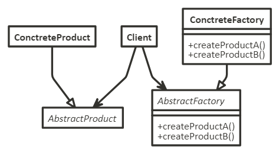

**Участники**:
- `AbstractFactory` - абстрактная фабрика:
    - объявляет интерфейс для операций, создающих абстрактные объекты-продукты;
- `ConcreteFactory` - конкретная фабрика:
    - реализует операции, создающие конкретные объекты-продукты;
- `AbstractProduct` - абстрактный продукт:
    - объявляет интерфейс для типа объекта-продукта;
- `ConcreteProduct` - конкретный продукт:
    - определяет объект-продукт, создаваемый соответствующей конкретной фабрикой;
    - реализует интерфейс `AbstractProduct`;
- `Client` - клиент:
    - пользуется исключительно интерфейсами, которые объявлены в классах `AbstractFactory` и `AbstractProduct`.

**Отношения**:
- обычно во время выполнения создается единственный экземпляр класса `ConcreteFactory`. Эта конкретная фабрика создает объекты-продукты, имеющие вполне определенную реализацию. Для создания других видов объектов клиент должен воспользоваться другой конкретной фабрикой;
- `AbstractFactory` передоверяет создание объектов-продуктов своему подклассу `ConcreteFactory`.

**Плюсы**:	
- изолирует конкретные классы. Помогает контролировать классы объектов, создаваемых приложением. Поскольку фабрика инкапсулирует ответственность за создание классов и сам процесс их создания, то она изолирует клиента от деталей реализации классов. Клиенты манипулируют экземплярами через их абстрактные интерфейсы. Имена изготавливаемых классов известны только конкретной фабрике, в коде клиента они не упоминаются;
- упрощает замену семейств продуктов. Класс конкретной фабрики появляется в приложении только один раз: при инстанцировании. Это облегчает замену используемой приложением конкретной фабрики;
- гарантирует сочетаемость продуктов. Если продукты некоторого семейства спроектированы для совместного использования, то важно, чтобы приложение в каждый момент времени работало только с продуктами единственного семейства.

**Минусы**:	
- сложно добавить поддержку нового вида продуктов.

[Пример паттерна Абстрактная фабрика](../assets/Patterns/AbstractFactory.js)

#### <a id="Паттерн-Строитель-Builder" href="#Паттерн-Строитель-Builder">Паттерн Строитель (Builder)</a> [<a id="Содержание" href="#Содержание">Содержание</a>]

*Шаблон позволяет создавать разные свойства объекта, избегая загрязнения конструктора (constructor pollution). Это полезно, когда у объекта может быть несколько свойств. Или когда создание объекта состоит из большого количества этапов.*

Шаблон "Строитель" предназначен для поиска решения проблемы антипаттерна Telescoping constructor (когда в конструкторе количество параметров может быстро разрастись, и станет трудно разобраться в их структуре и они имеют много не обязательных значений).

**Назначение**

Отделяет конструирование сложного объекта от его представления, так что в результате одного и того же процесса конструирования могут получаться разные представления.

**Применимость**:
- когда алгоритм создания сложного объекта не должен зависеть от того, из каких частей состоит объект и как они стыкуются между собой;
- когда процесс конструирования должен обеспечивать различные представления конструируемого объекта.

**Изображение**

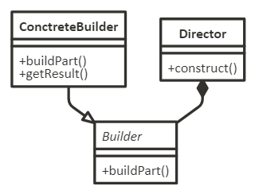

**Участники**:
- `Builder` - строитель:
    - задает абстрактный интерфейс для создания частей объекта `Product`;
- `ConcreteBuilder` - конкретный строитель:
    - конструирует и собирает вместе части продукта посредством реализации интерфейса `Builder`;
    - определяет создаваемое представление и следит за ним;
    - предоставляет интерфейс для доступа к продукту;
- `Director` - распорядитель:
    - конструирует объект, пользуясь интерфейсом `Builder`;
- `Product` - продукт:
    - представляет сложный конструируемый объект. `ConcreteBuilder` строит внутреннее представление продукта и определяет процесс его сборки;
    - включает классы, которые определяют составные части, в том числе интерфейсы для сборки конечного результата из частей.

**Отношения**:
- клиент создает объект-распорядитель `Director` и конфигурирует его нужным объектом-строителем `Builder`;
- распорядитель уведомляет строителя о том, что нужно построить очередную часть продукта;
- строитель обрабатывает запросы распорядителя и добавляет новые части к продукту;
- клиент забирает продукт у строителя.

**Плюсы**:	
- позволяет изменять внутреннее представление продукта. Объект `Builder` предоставляет распорядителю абстрактный интерфейс для конструирования продукта, за которым он может скрыть представление и внутреннюю структуру продукта, а также процесс его сборки. Поскольку продукт конструируется через абстрактный интерфейс, то для изменения внутреннего представления достаточно всего лишь определить новый вид строителя;
- изолирует код, реализующий конструирование и представление. Паттерн строитель улучшает модульность, инкапсулируя способ конструирования и представления сложного объекта. Клиентам ничего не надо знать о классах, определяющих внутреннюю структуру продукта, они отсутствуют в интерфейсе строителя;
- дает более тонкий контроль над процессом конструирования, чем другие порождающие паттерны.

[Пример паттерна Строитель](../assets/Patterns/Builder.js)

#### <a id="Паттерн-Прототип-Prototype" href="#Паттерн-Прототип-Prototype">Паттерн Прототип (Prototype)</a> [<a id="Содержание" href="#Содержание">Содержание</a>]

*Объект создаётся посредством клонирования существующего объекта.*

Шаблон "Прототип" используется, когда типы создаваемых объектов определяются экземпляром-прототипом, клонированным для создания новых объектов.

То есть шаблон позволяет дублировать существующий объект и модифицировать копию в соответствии с потребностями. Без заморочек с созданием объекта с нуля и его настройкой.

**Назначение**

Задает виды создаваемых объектов с помощью экземпляра-прототипа и создает новые объекты путем копирования этого прототипа.

**Применимость**:
- когда инстанцируемые классы определяются во время выполнения, например с помощью динамической загрузки;
- для того чтобы избежать построения иерархий классов или фабрик, параллельных иерархии классов продуктов;
- когда экземпляры класса могут находиться в одном из не очень большого числа различных состояний. Может оказаться удобнее установить соответствующее число прототипов и клонировать их, а не инстанцировать каждый раз класс вручную в подходящем состоянии.

**Изображение**

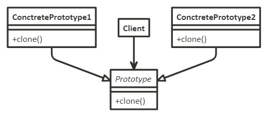

**Участники**:
- `Prototype` - прототип:
    - объявляет интерфейс для клонирования самого себя;
- `ConcretePrototype` - конкретный прототип:
    - реализует операцию клонирования себя;
- `Client` - клиент:
    - создает новый объект, обращаясь к прототипу с запросом клонировать себя.

**Отношения**:
- клиент обращается к прототипу, чтобы тот создал свою копию.

**Плюсы**:
- скрывает от клиента конкретные классы продуктов, уменьшая тем самым число известных клиенту имен;
- позволяет клиентам работать со специфичными для приложения классами без модификаций;
- позволяет добавление и удаление продуктов во время выполнения.  Прототип позволяет включать новый конкретный класс продуктов в систему, просто сообщив клиенту о новом экземпляре-прототипе. Это несколько более гибкое решение по сравнению с тем, что удастся сделать с помощью других порождающих паттернов, ибо клиент может устанавливать и удалять прототипы во время выполнения;
- спецификация новых объектов путем изменения значений.  Динамичные системы позволяют определять поведение за счет композиции объектов - например, путем задания значений переменных объекта, - а не с помощью определения новых классов. По сути дела, вы определяете новые виды объектов, инстанцируя уже существующие классы и регистрируя их экземпляры как прототипы клиентских объектов. Клиент может изменить поведение, делегируя свои обязанности прототипу;
- специфицирование новых объектов путем изменения структуры. Многие приложения строят объекты из крупных и мелких составляющих;
- уменьшение числа подклассов. Прототип позволяет клонировать прототип, а не запрашивать фабричный метод создать новый объект;
- динамическое конфигурирование приложения классами. Некоторые среды позволяют динамически загружать классы в приложение во время его выполнения.

**Минусы**:
- каждый подкласс класса `Prototype` должен реализовывать операцию `clone`, а это далеко не всегда просто. Проблемы возникают и в случае, если во внутреннем представлении объекта есть другие объекты или наличествуют круговые ссылки.

[Пример паттерна Прототип](../assets/Patterns/Prototype.js)

#### <a id="Паттерн-Одиночка-Singleton" href="#Паттерн-Одиночка-Singleton">Паттерн Одиночка (Singleton)</a> [<a id="Содержание" href="#Содержание">Содержание</a>]

*Шаблон позволяет удостовериться, что создаваемый объект - единственный в своём классе.*

Шаблон "Одиночка" позволяет ограничивать создание класса единственным объектом. Это удобно, когда для координации действий в рамках системы требуется, чтобы объект был единственным в своём классе.

**Назначение**

Гарантирует, что у класса есть только один экземпляр, и предоставляет к нему глобальную точку доступа.

**Применимость**:
- когда должен быть ровно один экземпляр некоторого класса, легко доступный всем клиентам;
- когда единственный экземпляр должен расширяться путем порождения подклассов, и клиентам нужно иметь возможность работать с расширенным экземпляром без модификации своего кода.

**Изображение**

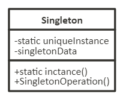

**Участники**:
- `Singleton` - одиночка:
    - определяет операцию `instance`, которая позволяет клиентам получать доступ к единственному экземпляру. `instance` - это операция класса, то есть метод класса или статическая функция-член;
    - может нести ответственность за создание собственного уникального экземпляра.

**Отношения**:
- клиенты получают доступ к экземпляру класса `Singleton` только через его операцию `instance`.

**Плюсы**:
- контролируемый доступ к единственному экземпляру. Поскольку класс `Singleton` инкапсулирует свой единственный экземпляр, он полностью контролирует то, как и когда клиенты получают доступ к нему;
- уменьшение числа имен. Паттерн одиночка - шаг вперед по сравнению с глобальными переменными. Он позволяет избежать засорения пространства имен глобальными переменными, в которых хранятся уникальные экземпляры;
- допускает уточнение операций и представления. От класса `Singleton` можно порождать подклассы, а приложение легко сконфигурировать экземпляром расширенного класса. Можно конкретизировать приложение экземпляром того класса, который необходим во время выполнения;
- допускает переменное число экземпляров. Паттерн позволяет вам легко изменить свое решение и разрешить появление более одного экземпляра класса `Singleton`. Вы можете применять один и тот же подход для управления числом экземпляров, используемых в приложении. Изменить нужно будет лишь операцию, дающую доступ к экземпляру класса `Singleton`;
- большая гибкость, чем у операций класса.

**Минусы**:
- глобальные объекты могут быть вредны для объектного программирования, в некоторых случаях приводя к созданию немасштабируемого проекта;
- делает код сильно связанным;
- усложняет написание модульных тестов.

[Пример паттерна Одиночка](../assets/Patterns/Singleton.js)

### <a id="Структурные-шаблоны-проектирования" href="#Структурные-шаблоны-проектирования">Структурные шаблоны проектирования</a> [<a id="Содержание" href="#Содержание">Содержание</a>]

*Эти шаблоны в основном посвящены компоновке объектов (object composition). То есть тому, как сущности могут друг друга использовать. Структурные шаблоны помогают ответить на вопрос "Как построить программный компонент?"*

Структурными называют шаблоны, которые облегчают проектирование, определяя простой способ реализации взаимоотношений между сущностями.

#### <a id="Паттерн-Адаптер-Adapter" href="#Паттерн-Адаптер-Adapter">Паттерн Адаптер (Adapter)</a> [<a id="Содержание" href="#Содержание">Содержание</a>]

*Шаблон "Адаптер" позволяет помещать несовместимый объект в обёртку, чтобы он оказался совместимым с другим классом.*

Шаблон проектирования "Адаптер" позволяет использовать интерфейс существующего класса как другой интерфейс. Этот шаблон часто применяется для обеспечения работы одних классов с другими без изменения их исходного кода.

**Назначение**
Преобразует интерфейс одного класса в интерфейс другого, который ожидают клиенты. Адаптер обеспечивает совместную работу классов с несовместимыми интерфейсами, которая без него была бы невозможна.

**Применимость**:
- когда можно использовать существующий класс, но его интерфейс не соответствует потребностям;
- когда можно создать повторно используемый класс, который должен взаимодействовать с заранее неизвестными или не связанными с ним классами, имеющими несовместимые интерфейсы;
- (только для адаптера объектов!) когда нужно использовать несколько существующих подклассов, но непрактично адаптировать их интерфейсы путем порождения новых подклассов от каждого. В этом случае адаптер объектов может приспосабливать интерфейс их общего родительского класса.

**Изображение**

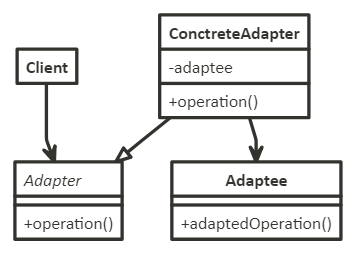

**Участники**:
- `Adapter` - целевой:
    - определяет зависящий от предметной области интерфейс, которым пользуется `Client`;
- `Client` - клиент:
    - вступает во взаимоотношения с объектами, удовлетворяющими интерфейсу `Adapter`;
- `Adaptee` - адаптируемый:
    - определяет существующий интерфейс, который нуждается в адаптации;
- `ConcreteAdapter` - адаптер:
    - адаптирует интерфейс `Adaptee` к интерфейсу `Adapter`.

**Отношения**:
- клиенты вызывают операции экземпляра адаптера `Adapter`. В свою очередь адаптер вызывает операции адаптируемого объекта или класса `Adaptee`, который и выполняет запрос.

**Плюсы**:	
- инкапсуляция реализации внешних классов (компонентов, библиотек), система становится независимой от интерфейса внешних классов;
- позволяет адаптеру `Adapter` заместить некоторые операции адаптируемого класса `Adaptee`, так как `Adapter` есть не что иное, как подкласс `Adaptee`.;
- позволяет одному адаптеру `Adapter` работать со многим адаптируемыми объектами `Adaptee`, то есть с самим `Adaptee` и его подклассами (если таковые имеются). Адаптер может добавить новую функциональность сразу всем адаптируемым объектам;
- переход на использование других внешних классов не требует переделки самой системы, достаточно реализовать один класс `Adapter`.

**Минусы**:
- затрудняет замещение операций класса `Adaptee`. Для этого потребуется породить от `Adaptee` подкласс и заставить `Adapter` ссылаться на этот подкласс, а не на сам `Adaptee`.

[Пример паттерна Адаптер](../assets/Patterns/Adapter.js)

#### <a id="Паттерн-Мост-Bridge" href="#Паттерн-Мост-Bridge">Паттерн Мост (Bridge)</a> [<a id="Содержание" href="#Содержание">Содержание</a>]

*Шаблон "Мост" - это предпочтение компоновки наследованию. Подробности реализации передаются из одной иерархии другому объекту с отдельной иерархией.*

Шаблон "Мост" означает отделение абстракции от реализации, чтобы их обе можно было изменять независимо друг от друга.

**Назначение**

Отделить абстракцию от ее реализации так, чтобы то и другое можно было изменять независимо.

**Применимость**:
- когда можно избежать постоянной привязки абстракции к реализации;
- когда и абстракции, и реализации должны расширяться новыми подклассами. В таком случае паттерн мост позволяет комбинировать разные абстракции и реализации и изменять их независимо;
- когда изменения в реализации абстракции не должны сказываться на клиентах, то есть клиентский код не должен перекомпилироваться;
- когда число классов начинает быстро расти. Это признак того, что иерархию следует разделить на две части;
- когда можно разделить одну реализацию между несколькими объектами (быть может, применяя подсчет ссылок), и этот факт необходимо скрыть от клиента.

**Изображение**

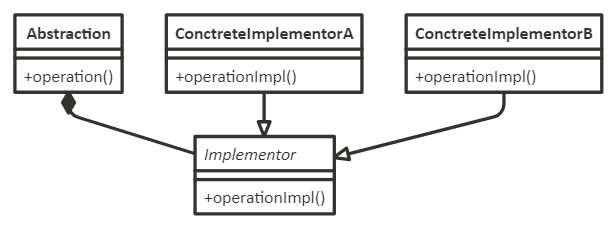

**Участники**:
- `Abstraction` - абстракция:
    - определяет интерфейс абстракции;
    - хранит ссылку на объект типа `Implementor`;
- `Implementor` - реализатор:
    - определяет интерфейс для классов реализации. Он не обязан точно соответствовать интерфейсу класса `Abstraction`. На самом деле оба интерфейса могут быть совершенно различны. Обычно интерфейс класса `Implementor` предоставляет только примитивные операции, а класс `Abstraction` определяет операции более высокого уровня, базирующиеся на этих примитивах;
`Concretelmplementor` - конкретный реализатор:
    - содержит конкретную реализацию интерфейса класса `Implementor`.

**Отношения**:
- объект `Abstraction` перенаправляет своему объекту `Implementor` запросы клиента.

**Плюсы**:
- отделение реализации от интерфейса. Реализация больше не имеет постоянной привязки к интерфейсу. Реализацию абстракции можно конфигурировать во время выполнения. Объект может даже динамически изменять свою реализацию;
- повышение степени расширяемости. Можно расширять независимо иерархии классов `Abstraction` и `Implementor`;
- сокрытие деталей реализации от клиентов. Клиентов можно изолировать от таких деталей реализации, как разделение объектов класса `Implementor`.

[Пример паттерна Мост](../assets/Patterns/Bridge.js)

#### <a id="Паттерн-Компоновщик-Composite" href="#Паттерн-Компоновщик-Composite">Паттерн Компоновщик (Composite)</a> [<a id="Содержание" href="#Содержание">Содержание</a>]

*Шаблон "Компоновщик" позволяет клиентам обрабатывать отдельные объекты в едином порядке.*

Шаблон "Компоновщик" описывает общий порядок обработки группы объектов, словно это одиночный экземпляр объекта. Суть шаблона - компонование объектов в древовидную структуру для представления иерархии от частного к целому. Шаблон позволяет клиентам одинаково обращаться к отдельным объектам и к группам объектов.

**Назначение**

Компонует объекты в древовидные структуры для представления иерархий часть-целое. Позволяет клиентам единообразно трактовать индивидуальные и составные объекты.

**Применимость**:
- когда можно представить иерархию объектов вида часть-целое;
- когда можно, чтобы клиенты единообразно трактовали составные и индивидуальные объекты.

**Изображение**

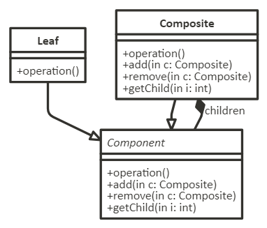

**Участники**:
- `Component` - компонент:
    - объявляет интерфейс для компонуемых объектов;
    - предоставляет подходящую реализацию операций по умолчанию, общую для всех классов;
    - объявляет интерфейс для доступа к потомкам и управления ими;
    - определяет интерфейс для доступа к родителю компонента в рекурсивной структуре и при необходимости реализует его. Описанная возможность необязательна;
- `Leaf` - лист:
    - представляет листовые узлы композиции и не имеет потомков;
    - определяет поведение примитивных объектов в композиции;
- `Composite` - составной объект:
    - определяет поведение компонентов, у которых есть потомки;
    - хранит компоненты-потомки;
    - реализует относящиеся к управлению потомками операции в интерфейсе класса `Component`.

**Отношения**:
- клиенты используют интерфейс класса `Component` для взаимодействия с объектами в составной структуре. Если получателем запроса является листовый объект `Leaf`, то он и обрабатывает запрос. Когда же получателем является составной объект `Composite`, то обычно он перенаправляет запрос своим потомкам, возможно, выполняя некоторые дополнительные операции до или после перенаправления.

**Плюсы**:
- определяет иерархии классов, состоящие из примитивных и составных объектов. Из примитивных объектов можно составлять более сложные, которые, в свою очередь, участвуют в более сложных композициях и так далее;
- упрощает архитектуру клиента. Клиенты могут единообразно работать с индивидуальными и объектами и с составными структурами;
- облегчает добавление новых видов компонентов. Новые подклассы классов `Composite` или `Leaf` будут автоматически работать с уже существующими структурами и клиентским кодом.

**Минусы**:
- способствует созданию общего дизайна. Однако такая простота добавления новых компонентов имеет и свои отрицательные стороны: становится трудно наложить ограничения на то, какие объекты могут входить в состав композиции.

[Пример паттерна Компоновщик](../assets/Patterns/Composite.js)

#### <a id="Паттерн-Декоратор-Decorator" href="#Паттерн-Декоратор-Decorator">Паттерн Декоратор (Decorator)</a> [<a id="Содержание" href="#Содержание">Содержание</a>]

*Шаблон "Декоратор" позволяет во время выполнения динамически изменять поведение объекта, обёртывая его в объект класса "декоратора".*

Шаблон "Декоратор" позволяет подключать к объекту дополнительное поведение (статически или динамически), не влияя на поведение других объектов того же класса. Шаблон часто используется для соблюдения принципа единственной обязанности (**Single Responsibility Principle**), поскольку позволяет разделить функциональность между классами для решения конкретных задач.

**Назначение**

Динамически добавляет объекту новые обязанности. Является гибкой альтернативой порождению подклассов с целью расширения функциональности.

**Применимость**:
- для динамического, прозрачного для клиентов добавления обязанностей объектам;
- для реализации обязанностей, которые могут быть сняты с объекта;
- когда расширение путем порождения подклассов по каким-то причинам неудобно или невозможно. Иногда приходится реализовывать много независимых расширений, так что порождение подклассов для поддержки всех возможных комбинаций приведет к комбинаторному росту их числа. В других случаях определение класса может быть скрыто или почему-либо еще недоступно, так что породить от него подкласс нельзя.

**Изображение**

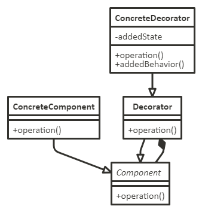

**Участники**:
- `Component` - компонент:
    - определяет интерфейс для объектов, на которые могут быть динамически возложены дополнительные обязанности;
- `ConcreteComponent` - конкретный компонент:
    - определяет объект, на который возлагаются дополнительные обязанности;
- `Decorator` - декоратор:
    - хранит ссылку на объект `Component` и определяет интерфейс, соответствующий интерфейсу `Component`;
- `ConcreteDecorator` - конкретный декоратор:
    - возлагает дополнительные обязанности на компонент.

**Отношения**:
- `Decorator` переадресует запросы объекту `Component`. Может выполнять и дополнительные операции до и после переадресации.

**Плюсы**:
- большая гибкость, нежели у статического наследования. Паттерн декоратор позволяет более гибко добавлять объекту новые обязанности, чем было бы возможно в случае статического (множественного) наследования. Декоратор может добавлять и удалять обязанности во время выполнения программы;
- позволяет избежать перегруженных функциями классов на верхних уровнях иерархии. Декоратор разрешает добавлять новые обязанности по мере необходимости.

**Минусы**:
- декоратор и его компонент не идентичны. Декоратор действует как прозрачное обрамление. Но декорированный компонент все же не идентичен исходному;
- множество мелких объектов. При использовании в проекте паттерна декоратор нередко получается система, составленная из большого числа мелких объектов, которые похожи друг на друга и различаются только способом взаимосвязи, а не классом и не значениями своих внутренних переменных.

[Пример паттерна Декоратор](../assets/Patterns/Decorator.js)

#### <a id="Паттерн-Фасад-Facade" href="#Паттерн-Фасад-Facade">Паттерн Фасад (Facade)</a> [<a id="Содержание" href="#Содержание">Содержание</a>]

*Шаблон "Фасад" предоставляет упрощённый интерфейс для сложной подсистемы.*

"Фасад" - это объект, предоставляющий упрощённый интерфейс для более крупного тела кода, например библиотеки классов.

**Назначение**

Предоставляет унифицированный интерфейс вместо набора интерфейсов некоторой подсистемы. Фасад определяет интерфейс более высокого уровня, который упрощает использование подсистемы.

**Применимость**:
- когда можно предоставить простой интерфейс к сложной подсистеме;
- когда между клиентами и классами реализации абстракции существует много зависимостей;
- когда вы можете разложить подсистему на отдельные слои.

**Изображение**

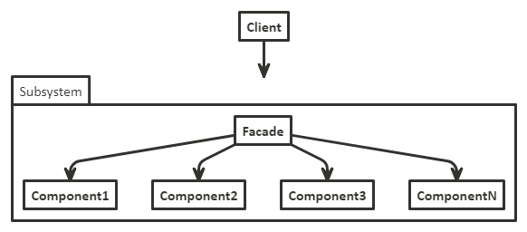

Участники
- `Facade` - фасад:
    - "знает", каким классам подсистемы адресовать запрос;
    - делегирует запросы клиентов подходящим объектам внутри подсистемы;
- классы подсистемы:
    - реализуют функциональность подсистемы;
    - выполняют работу, порученную объектом `Facade`;
    - ничего не "знают" о существовании фасада, то есть не хранят ссылок на него.

**Отношения**:
- клиенты общаются с подсистемой, посылая запросы фасаду. Он переадресует их подходящим объектам внутри подсистемы. Хотя основную работу выполняют именно объекты подсистемы, фасаду, возможно, придется преобразовать свой интерфейс в интерфейсы подсистемы;
- клиенты, пользующиеся фасадом, не имеют прямого доступа к объектам подсистемы.

**Плюсы**:
- изолирует клиентов от компонентов подсистемы, уменьшая тем самым число объектов, с которыми клиентам приходится иметь дело, и упрощая работу с подсистемой;
- позволяет ослабить связанность между подсистемой и ее клиентами. Слабая связанность позволяет видоизменять компоненты, не затрагивая при этом клиентов. Фасады помогают разложить систему на слои и структурировать зависимости между объектами, а также избежать сложных и циклических зависимостей.;
- фасад не препятствует приложениям напрямую обращаться к классам подсистемы, если это необходимо.

[Пример паттерна Фасад](../assets/Patterns/Facade.js)

#### <a id="Паттерн-Приспособленец-Flyweight" href="#Паттерн-Приспособленец-Flyweight">Паттерн Приспособленец (Flyweight)</a> [<a id="Содержание" href="#Содержание">Содержание</a>]

*Шаблон применяется для минимизирования использования памяти или вычислительной стоимости за счёт общего использования как можно большего количества одинаковых объектов.*

"Приспособленец" - это объект, минимизирующий использование памяти за счёт общего с другими, такими же объектами использования как можно большего объёма данных. Это способ применения многочисленных объектов, когда простое повторяющееся представление приведёт к неприемлемому потреблению памяти.

**Назначение**

Использует разделение для эффективной поддержки множества мелких объектов.

**Применимость**:
- когда в приложении используется большое число объектов;
- когда из-за этого накладные расходы на хранение высоки;
- когда большую часть состояния объектов можно вынести вовне;
- когда многие группы объектов можно заменить относительно небольшим количеством разделяемых объектов, поскольку внешнее состояние вынесено;
- когда приложение не зависит от идентичности объекта. Поскольку объекты-приспособленцы могут разделяться, то проверка на идентичность возвратит "истину" для концептуально различных объектов.

**Изображение**

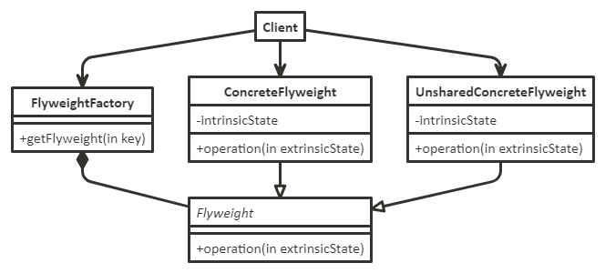

**Участники**:
- `Flyweight` - приспособленец:
    - объявляет интерфейс, с помощью которого приспособленцы могут получать внешнее состояние или как-то воздействовать на него;
- `ConcreteFlyweight` - конкретный приспособленец:
    - реализует интерфейс класса `Flyweight` и добавляет при необходимости внутреннее состояние. Объект класса `ConcreteFlyweight` должен быть разделяемым. Любое сохраняемое им состояние должно быть внутренним, то есть не зависящим от контекста;
- `UnsharedConcreteFlyweight` - неразделяемый конкретный приспособленец:
    - не все подклассы `Flyweight` обязательно должны быть разделяемыми. Интерфейс `Flyweight` допускает разделение, но не навязывает его. Часто у объектов `UnsharedConcreteFlyweight` на некотором уровне структуры приспособленца есть потомки в виде объектов класса `ConcreteFlyweight`;
- `FlyweightFactory` - фабрика приспособленцев:
    - создает объекты-приспособленцы и управляет ими;
    - обеспечивает должное разделение приспособленцев. Когда клиент запрашивает приспособленца, объект `FlyweightFactory` предоставляет существующий экземпляр или создает новый, если готового еще нет;
- `Client` - клиент:
    - хранит ссылки на одного или нескольких приспособленцев;
    - вычисляет или хранит внешнее состояние приспособленцев.

**Отношения**:
- состояние, необходимое приспособленцу для нормальной работы, можно охарактеризовать как внутреннее или внешнее. Первое хранится в самом объекте `ConcreteFlyweight`. Внешнее состояние хранится или вычисляется клиентами. Клиент передает его приспособленцу при вызове операций;
- клиенты не должны создавать экземпляры класса `ConcreteFlyweight` напрямую, а могут получать их только от объекта `FlyweightFactory`. Это позволит гарантировать корректное разделение.

**Плюсы**:
- уменьшение общего числа экземпляров;
- сокращение объема памяти, необходимого для хранения внутреннего состояния;
- вычисление, а не хранение внешнего состояния (если это действительно так).

**Минусы**:
- затраты на передачу, поиск или вычисление внутреннего состояния, особенно если раньше оно хранилось как внутреннее.

[Пример паттерна Приспособленец](../assets/Patterns/Flyweight.js)

#### <a id="Паттерн-Заместитель-Proxy" href="#Паттерн-Заместитель-Proxy">Паттерн Заместитель (Proxy)</a> [<a id="Содержание" href="#Содержание">Содержание</a>]

*С помощью шаблона "Заместитель" класс представляет функциональность другого класса.*

В наиболее общей форме "Заместитель" - это класс, функционирующий как интерфейс к чему-либо. Это оболочка или объект-агент, вызываемый клиентом для получения доступа к другому, "настоящему" объекту. "Заместитель" может просто переадресовывать запросы настоящему объекту, а может предоставлять дополнительную логику: кеширование данных при интенсивном выполнении операций или потреблении ресурсов настоящим объектом; проверка предварительных условий (preconditions) до вызова выполнения операций настоящим объектом.

**Назначение**

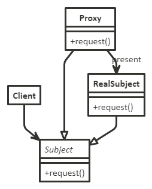

Является суррогатом другого объекта и контролирует доступ к нему.

**Применимость**:
- удаленный заместитель предоставляет локального представителя вместо объекта, находящегося в другом адресном пространстве;
- виртуальный заместитель создает "тяжелые" объекты по требованию;
- защищающий заместитель контролирует доступ к исходному объекту;
- "умная" ссылка - это замена обычного указателя. Она позволяет выполнить дополнительные действия при доступе к объекту;
- проверка	данных: прокси проверяет допустимость входных данных перед отправкой субъекту;
- безопасность: прокси проверяет наличие у клиента достаточных прав для выполнения операции и передает запрос субъекту только при положительном результате такой проверки;
- кэширование: прокси хранит внутренний кэш, вызывая субъекта, только если затребованные данные еще отсутствуют в кэше;
- отложенная инициализация: если создание субъекта сопряжено с большими накладными расходами, прокси может отложить эту операцию до момента, когда это станет действительно необходимо;
- журналирование: прокси перехватывает вызовы методов и их параметры, регистрируя их в журнале;
- обращение	к удаленным объектам: прокси может обеспечить работу с удаленным объектом как с локальным.

**Изображение**

**Участники**:
- `Proxy` - заместитель:
    - хранит ссылку, которая позволяет заместителю обратиться к реальному субъекту. Объект класса `Proxy` может обращаться к объекту класса `Subject`, если интерфейсы классов `RealSubject` и `Subject` одинаковы;
    - предоставляет интерфейс, идентичный интерфейсу `Subject`, так что заместитель всегда может быть подставлен вместо реального субъекта;
    - контролирует доступ к реальному субъекту и может отвечать за его создание и удаление;
    - прочие обязанности зависят от вида заместителя:
    - удаленный заместитель отвечает за кодирование запроса и его аргументов и отправление закодированного запроса реальному субъекту в другом адресном пространстве;
    - виртуальный заместитель может кэшировать дополнительную информацию о реальном субъекте, чтобы отложить его создание;
    - защищающий заместитель проверяет, имеет ли вызывающий объект необходимые для выполнения запроса права;
- `Subject` - субъект:
    - определяет общий для `RealSubject` и `Proxy` интерфейс, так что класс `Proxy` можно использовать везде, где ожидается `RealSubject`;
- `RealSubject` - реальный субъект:
    - определяет реальный объект, представленный заместителем.

**Отношения**:
- `Proxy` при необходимости переадресует запросы объекту `RealSubject`. Детали зависят от вида заместителя.

**Плюсы**:
- удаленный заместитель может скрыть тот факт, что объект находится в другом адресном пространстве;
- виртуальный заместитель может выполнять оптимизацию, например создание объекта по требованию;
- защищающий заместитель и "умная" ссылка позволяют решать дополнительные задачи при доступе к объекту;
- копированием при записи (copy-on-write).

**Минусы**:
- резкое увеличение времени отклика.

[Пример паттерна Заместитель](../assets/Patterns/Proxy.js)

### <a id="Поведенческие-шаблоны-проектирования" href="#Поведенческие-шаблоны-проектирования">Поведенческие шаблоны проектирования</a> [<a id="Содержание" href="#Содержание">Содержание</a>]

*Они связаны с присвоением обязанностей (responsibilities) объектам. От структурных шаблонов они отличаются тем, что не просто описывают структуру, но и очерчивают шаблоны передачи данных, обеспечения взаимодействия. То есть поведенческие шаблоны позволяют ответить на вопрос "Как реализовать поведение в программном компоненте?"*

Поведенческие шаблоны проектирования определяют алгоритмы и способы реализации взаимодействия различных объектов и классов. Они обеспечивают гибкость взаимодействия между объектами.

#### <a id="Паттерн-Цепочка-обязанностей-Chain-of-responsibility" href="#Паттерн-Цепочка-обязанностей-Chain-of-responsibility">Паттерн Цепочка обязанностей (Chain of responsibility)</a> [<a id="Содержание" href="#Содержание">Содержание</a>]

*Шаблон "Цепочка обязанностей" позволяет создавать цепочки объектов. Запрос входит с одного конца цепочки и движется от объекта к объекту, пока не будет найден подходящий обработчик.*

Шаблон "Цепочка обязанностей" содержит исходный управляющий объект и ряд обрабатывающих объектов. Каждый обрабатывающий объект содержит логику, определяющую типы командных объектов, которые он может обрабатывать, а остальные передаются по цепочке следующему обрабатывающему объекту.

**Назначение**

Позволяет избежать привязки отправителя запроса к его получателю, давая шанс обработать запрос нескольким объектам. Связывает объекты-получатели в цепочку и передает запрос вдоль этой цепочки, пока его не обработают.

**Применимость**:
- когда есть более одного объекта, способного обработать запрос, причем настоящий обработчик заранее неизвестен и должен быть найден автоматически;
- когда можно отправить запрос одному из нескольких объектов, не указывая явно, какому именно;
- когда набор объектов, способных обработать запрос, должен задаваться динамически.

**Изображение**

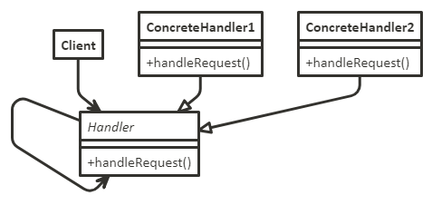

**Участники**:
- `Handler` - обработчик:
    - определяет интерфейс для обработки запросов;
    - (необязательно) реализует связь с преемником;
- `ConcreteHandler` - конкретный обработчик:
    - обрабатывает запрос, за который отвечает;
    - имеет доступ к своему преемнику;
    - если `ConcreteHandler` способен обработать запрос, то так и делает, если не может, то направляет его - его своему преемнику;
- `Client` - клиент:
    - отправляет запрос некоторому объекту `ConcreteHandler` в цепочке.

**Отношения**:
- когда клиент инициирует запрос, он продвигается по цепочке, пока некоторый объект `ConcreteHandler` не возьмет на себя ответственность за его обработку.

**Плюсы**:
- ослабление связанности. Этот паттерн освобождает объект от необходимости "знать", кто конкретно обработает его запрос;
- дополнительная гибкость при распределении обязанностей между объектами.

**Минусы**:
- получение не гарантировано. Поскольку у запроса нет явного получателя, то нет и гарантий, что он вообще будет обработан: он может достичь конца цепочки и пропасть.

[Пример паттерна Цепочка обязанностей](../assets/Patterns/ChainOfResponsibility.js)

[Пример паттерна Цепочка обязанностей (функции)](../assets/Patterns/ChainOfResponsibilityFunction.js)

#### <a id="Паттерн-Команда-Command" href="#Паттерн-Команда-Command">Паттерн Команда (Command)</a> [<a id="Содержание" href="#Содержание">Содержание</a>]

*Шаблон "Команда" позволяет инкапсулировать действия в объекты. Ключевая идея - предоставить средства отделения клиента от получателя.*

В шаблоне "Команда" объект используется для инкапсуляции всей информации, необходимой для выполнения действия либо для его инициирования позднее. Информация включает в себя имя метода; объект, владеющий методом; значения параметров метода.

**Назначение**

Инкапсулирует запрос как объект, позволяя тем самым задавать параметры клиентов для обработки соответствующих запросов, ставить запросы в очередь или протоколировать их, а также поддерживать отмену операций.

**Применимость**:
- когда можно параметризовать объекты выполняемым действием. В процедурном языке такую параметризацию можно выразить с помощью функции обратного вызова, то есть такой функции, которая регистрируется, чтобы быть вызванной позднее. Команды представляют собой объектно-ориентированную альтернативу функциям обратного вызова;
- когда можно определять, ставить в очередь и выполнять запросы в разное время. Время жизни объекта `Command` необязательно должно зависеть от времени жизни исходного запроса;
- когда можно поддержать отмену операций. Операция `execute` объекта `Command` может сохранить состояние, необходимое для отката действий, выполненных командой. В этом случае в интерфейсе класса `Command` должна быть дополнительная операция `unexecute`, которая отменяет действия, выполненные предшествующим обращением к `execute`. Выполненные команды хранятся в списке истории;
- когда можно поддержать протоколирование изменений, чтобы их можно было выполнить повторно после аварийной остановки системы;
- когда можно структурировать систему на основе высокоуровневых операций, построенных из примитивных. Такая структура типична для информационных систем, поддерживающих транзакции. Транзакция инкапсулирует набор изменений данных. У всех команд есть общий интерфейс, что дает возможность работать одинаково с любыми транзакциями, так можно легко добавлять в систему новые виды транзакций.

**Изображение**

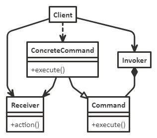

**Участники**:
- `Command` - команда:
    - объявляет интерфейс для выполнения операции;
- `ConcreteCommand` - конкретная команда:
    - определяет связь между объектом-получателем `Receiver` и действием;
    - реализует операцию `execute` путем вызова соответствующих операций объекта `Receiver`;
- `Client` - клиент:
    - создает объект класса `ConcreteCommand` и устанавливает его получателя;
- `Invoker` - инициатор:
    - обращается к команде для выполнения запроса;
- `Receiver` - получатель:
    - располагает информацией о способах выполнения операций, необходимых для удовлетворения запроса. В роли получателя может выступать любой класс.

**Отношения**:
- клиент создает объект `ConcreteCommand` и устанавливает для него получателя;
- инициатор `Invoker` сохраняет объект `ConcreteCommand`;
- инициатор отправляет запрос, вызывая операцию команды `execute`. Если поддерживается отмена выполненных действий, то `ConcreteCommand` перед вызовом `execute` сохраняет информацию о состоянии, достаточную для выполнения отката;
- объект `ConcreteCommand` вызывает операции получателя для выполнения запроса.

**Плюсы**:
- команда разрывает связь между объектом, инициирующим операцию, и объектом, имеющим информацию о том, как ее выполнить;
- команды - это самые настоящие объекты. Допускается манипулировать ими и расширять их точно так же, как в случае с любыми другими объектами;
- из простых команд можно собирать составные. В общем случае составные команды описываются паттерном компоновщик;
- добавлять новые команды легко, поскольку никакие существующие классы изменять не нужно.

[Пример паттерна Команда](../assets/Patterns/Command.js)

#### <a id="Паттерн-Интерпретатор-Interpreter" href="#Паттерн-Интерпретатор-Interpreter">Паттерн Интерпретатор (Interpreter)</a> [<a id="Содержание" href="#Содержание">Содержание</a>]

*Интерпретатор - паттерн поведения классов.*

**Назначение**

Для заданного языка определяет представление его грамматики, а также интерпретатор предложений этого языка.

**Применимость**:
- когда есть язык для интерпретации, предложения которого можно представить в виде абстрактных синтаксических деревьев;
- когда грамматика проста. Для сложных грамматик иерархия классов становится слишком громоздкой и неуправляемой;
- когда эффективность не является главным критерием. Наиболее эффективные интерпретаторы обычно не работают непосредственно с деревьями, а сначала транслируют их в другую форму.

**Изображение**

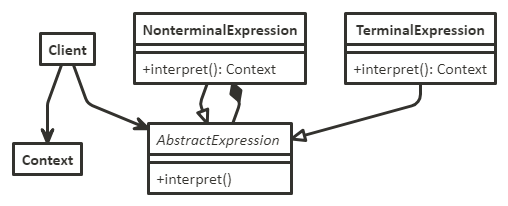

**Участники**:
- `AbstractExpression` - абстрактное выражение:
    - объявляет абстрактную операцию `Interpret`, общую для всех узлов в абстрактном синтаксическом дереве;
- `TerminalExpression` - терминальное выражение:
    - реализует операцию `Interpret` для терминальных символов грамматики;
    - необходим отдельный экземпляр для каждого терминального символа в предложении;
- `NonterminaIExpression` - нетерминальное выражение:
    - по одному такому классу требуется для каждого грамматического правила `R :: = R1 R2 ... Rn`;
    - хранит переменные экземпляра типа `AbstractExpression` для каждого символа от `R1` до `Rn`;
    - реализует операцию `Interpret` для нетерминальных символов грамматики. Эта операция рекурсивно вызывает себя же для переменных, представляющих `R1 R2 ... Rn`;
- `Context` - контекст:
    - содержит информацию, глобальную по отношению к интерпретатору;
- `Client` - клиент:
    - строит (или получает в готовом виде) абстрактное синтаксическое дерево, представляющее отдельное предложение на языке с данной грамматикой. Дерево составлено из экземпляров классов `NonterminalExpression` и `TerminalExpression`;
    - вызывает операцию `Interpret`.

**Отношения**:
- клиент строит (или получает в готовом виде) предложение в виде абстрактного синтаксического дерева, в узлах которого находятся объекты классов `NonterminalExpression` и `TerminalExpression`. Затем клиент инициализирует контекст и вызывает операцию `Interpret`;
- в каждом узле вида `NonterminalExpression` через операции `Interpret` определяется операция `Interpret` для каждого подвыражения. Для класса `TerminalExpression` операция `Interpret` определяет базу рекурсии;
- операции `Interpret` в каждом узле используют контекст для сохранения и доступа к состоянию интерпретатора.

**Плюсы**:
- грамматику легко изменять и расширять. Поскольку для представления грамматических правил в паттерне используются классы, то для изменения или расширения грамматики можно применять наследование;
- простая реализация грамматики. Реализации классов, описывающих узлы абстрактного синтаксического дерева, похожи;
- добавление новых способов интерпретации выражений, позволяет легко изменить способ вычисления выражений.

**Минусы**:
- сложные грамматики трудно сопровождать.

[Пример паттерна Интерпретатор]()

#### <a id="Паттерн-Итератор-Iterator" href="#Паттерн-Итератор-Iterator">Паттерн Итератор (Iterator)</a> [<a id="Содержание" href="#Содержание">Содержание</a>]

*Шаблон -- это способ доступа к элементам объекта без раскрытия базового представления.*

В этом шаблоне итератор используется для перемещения по контейнеру и обеспечения доступа к элементам контейнера. Шаблон подразумевает отделение алгоритмов от контейнера. В каких-то случаях алгоритмы, специфичные для этого контейнера, не могут быть отделены.

**Назначение**

Предоставляет способ последовательного доступа ко всем элементам составного объекта, не раскрывая его внутреннего представления.

**Применимость**:
- для доступа к содержимому агрегированных объектов без раскрытия их внутреннего представления;
- для поддержки нескольких активных обходов одного и того же агрегированного объекта;
- для предоставления единообразного интерфейса с целью обхода различных агрегированных структур (то есть для поддержки полиморфной итерации).

**Изображение**

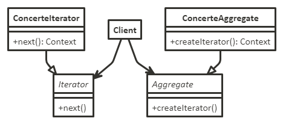

**Участники**:
- `Iterator` - итератор:
    - определяет интерфейс для доступа и обхода элементов;
- `Concretelterator` - конкретный итератор:
    - реализует интерфейс класса `Iterator`;
    - следит за текущей позицией при обходе агрегата;
- `Aggregate` - агрегат:
    - определяет интерфейс для создания объекта-итератора;
- `ConcreteAggregate` - конкретный агрегат:
    - реализует интерфейс создания итератора и возвращает экземпляр подходящего класса `Concretelterator`.

**Отношения**:
- `Concretelterator` отслеживает текущий объект в агрегате и может вычислить идущий за ним.

**Плюсы**:
- поддерживает различные виды обхода агрегата. Сложные агрегаты можно обходить по-разному;
- итераторы упрощают интерфейс класса `Aggregate`;
- одновременно для данного агрегата может быть активно несколько обходов.

[Пример паттерна Итератор](../assets/Patterns/Iterator.js)

[Пример паттерна Итератор с использованием стандартных итераторов](../assets/Patterns/IteratorStandart.js)

#### <a id="Паттерн-Посредник-Mediator" href="#Паттерн-Посредник-Mediator">Паттерн Посредник (Mediator)</a> [<a id="Содержание" href="#Содержание">Содержание</a>]

*Шаблон "Посредник" подразумевает добавление стороннего объекта ("посредника") для управления взаимодействием между двумя объектами ("коллегами"). Шаблон помогает уменьшить связанность (coupling) классов, общающихся друг с другом, ведь теперь они не должны знать о реализациях своих собеседников.*

Шаблон определяет объект, который инкапсулирует способ взаимодействия набора объектов.

**Назначение**

Определяет объект, инкапсулирующий способ взаимодействия множества объектов. Посредник обеспечивает слабую связанность системы, избавляя объекты от необходимости явно ссылаться друг на друга и позволяя тем самым независимо изменять взаимодействия между ними.

**Применимость**:
- когда имеются объекты, связи между которыми сложны и четко определены. Получающиеся при этом взаимозависимости не структурированы и трудны для понимания;
- когда нельзя повторно использовать объект, поскольку он обменивается информацией со многими другими объектами;
- когда поведение, распределенное между несколькими классами, должно поддаваться настройке без порождения множества подклассов.

**Изображение**

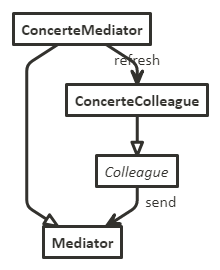

**Участники**:
- `Mediator` - посредник;
    - определяет интерфейс для обмена информацией с объектами `Colleague`;
- `ConcreteMediator` - конкретный посредник:
    - реализует кооперативное поведение, координируя действия объектов `Colleague`;
    - владеет информацией о коллегах и подсчитывает их;
- классы `Colleague` - коллеги:
    - каждый класс `Colleague` "знает" о своем объекте `Mediator`;
    - все коллеги обмениваются информацией только с посредником, так как при его отсутствии им пришлось бы общаться между собой напрямую.

**Отношения**:
- коллеги посылают запросы посреднику и получают запросы от него. Посредник реализует кооперативное поведение путем переадресации каждого запроса подходящему коллеге (или нескольким коллегам).

**Плюсы**:
- снижает число порождаемых подклассов. Посредник локализует поведение, которое в противном случае пришлось бы распределять между несколькими объектами;
- устраняет связанность между коллегами. Посредник обеспечивает слабую связанность коллег;
- упрощает протоколы взаимодействия объектов. Посредник заменяет дисциплину взаимодействия "все со всеми" дисциплиной "один со всеми", то есть один посредник взаимодействует со всеми коллегами;
- абстрагирует способ кооперирования объектов. Выделение механизма посредничества в отдельную концепцию и инкапсуляция ее в одном объекте позволяет сосредоточиться именно на взаимодействии объектов, а не на их индивидуальном поведении.

**Минусы**:
- централизует управление. Паттерн посредник переносит сложность взаимодействия в класс-посредник.  В результате сам посредник становится монолитом, который трудно сопровождать.

[Пример паттерна Посредник](../assets/Patterns/Mediator.js)

#### <a id="Паттерн-Хранитель-Memento" href="#Паттерн-Хранитель-Memento">Паттерн Хранитель (Memento)</a> [<a id="Содержание" href="#Содержание">Содержание</a>]

*Шаблон "Хранитель" фиксирует и хранит текущее состояние объекта, чтобы оно легко восстанавливалось.*

Шаблон "Хранитель" позволяет восстанавливать объект в его предыдущем состоянии (отмена через откат - undo via rollback).

Обычно шаблон применяется, когда нужно реализовать функциональность отмены операции.

**Назначение**
Не нарушая инкапсуляции, фиксирует и выносит за пределы объекта его внутреннее состояние так, чтобы позднее можно было восстановить в нем объект.

**Применимость**:
- когда необходимо сохранить мгновенный снимок состояния объекта (или его части), чтобы впоследствии объект можно было восстановить в том же состоянии;
- когда прямое получение этого состояния раскрывает детали реализации и нарушает инкапсуляцию объекта.

**Изображение**

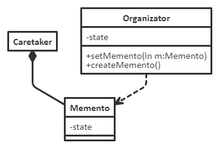

Участники:
- `Memento` - хранитель:
    - сохраняет внутреннее состояние объекта `Originator`. Объем сохраняемой информации может быть различным и определяется потребностями хозяина;
    - запрещает доступ всем другим объектам, кроме хозяина. По существу, у хранителей есть два интерфейса. "Посыльный" `Caretaker` "видит" лишь "узкий" интерфейс хранителя - он может только передавать хранителя другим объектам. Напротив, хозяину доступен "широкий" интерфейс, который обеспечивает доступ ко всем данным, необходимым для восстановления в прежнем состоянии. Идеальный вариант - когда только хозяину, создавшему хранитель, открыт доступ к внутреннему состоянию последнего;
- `Originator` - хозяин:
    - создает хранитель, содержащего снимок текущего внутреннего состояния;
    - использует хранитель для восстановления внутреннего состояния;
- `Caretaker` - посыльный:
    - отвечает за сохранение хранителя;
    - не производит никаких операций над хранителем и не исследует его внутреннее содержимое.

**Отношения**:
- посыльный запрашивает хранитель у хозяина, некоторое время держит его у себя, а затем возвращает хозяину. Иногда этого не происходит, так как последнему не нужно восстанавливать прежнее состояние;
- хранители пассивны. Только хозяин, создавший хранитель, имеет доступ к информации о состоянии.

**Плюсы**:
- сохранение границ инкапсуляции. Хранитель позволяет избежать раскрытия информации, которой должен распоряжаться только хозяин, но которую тем не менее необходимо хранить вне последнего;
- упрощение структуры хозяина. При перекладывании заботы о запрошенном состоянии на клиентов упрощается структура хозяина, а клиентам дается возможность не информировать хозяина о том, что они закончили работу.

**Минусы**:
- значительные издержки при использовании хранителей. С хранителями могут быть связаны заметные издержки, если хозяин должен копировать большой объем информации для занесения в память хранителя или если клиенты создают и возвращают хранителей достаточно часто;
- определение "узкого" и "широкого" интерфейсов;
- скрытая плата за содержание хранителя. Посыльный отвечает за удаление хранителя, однако не располагает информацией о том, какой объем информации о состоянии скрыт в нем.

[Пример паттерна Хранитель]()

#### <a id="Паттерн-Наблюдатель-Observer" href="#Паттерн-Наблюдатель-Observer">Паттерн Наблюдатель (Observer)</a> [<a id="Содержание" href="#Содержание">Содержание</a>]

*Шаблон определяет зависимость между объектами, чтобы при изменении состояния одного из них его "подчинённые" узнавали об этом.*

В шаблоне "Наблюдатель" есть объект ("**субъект**"), ведущий список своих "**подчинённых**" ("**наблюдателей**") и автоматически уведомляющий их о любом изменении своего состояния, обычно с помощью вызова одного из их методов.

**Назначение**

Определяет зависимость типа "**один ко многим**" между объектами таким образом, что при изменении состояния одного объекта все зависящие от него оповещаются об этом и автоматически обновляются.

**Применимость**:
- когда у абстракции есть два аспекта, один из которых зависит от другого. Инкапсуляции этих аспектов в разные объекты позволяют изменять и повторно использовать их независимо;
- когда при модификации одного объекта требуется изменить другие и вы не знаете, сколько именно объектов нужно изменить;
- когда один объект должен оповещать других, не делая предположений об уведомляемых объектах. Другими словами, вы не хотите, чтобы объекты были тесно связаны между собой.

**Изображение**

**Участники**:
- `Subject` - субъект:
    - располагает информацией о своих наблюдателях. За субъектом может "следить" любое число наблюдателей;
    - предоставляет интерфейс для присоединения и отделения наблюдателей;
- `Observer` - наблюдатель:
    - определяет интерфейс обновления для объектов, которые должны быть уведомлены об изменении субъекта;
- `ConcreteSubject` - конкретный субъект:
    - сохраняет состояние, представляющее интерес для конкретного наблюдателя `ConcreteObserver`;
    - посылает информацию своим наблюдателям, когда происходит изменение;
- `ConcreteObserver` - конкретный наблюдатель:
    - хранит ссылку на объект класса `ConcreteSubject`;
    - сохраняет данные, которые должны быть согласованы с данными субъекта;
    - реализует интерфейс обновления, определенный в классе `Observer`, чтобы поддерживать согласованность с субъектом.

**Отношения**:
- объект `ConcreteSubject` уведомляет своих наблюдателей о любом изменении, которое могло бы привести к рассогласованности состояний наблюдателя и субъекта;
- после получения от конкретного субъекта уведомления об изменении объект `ConcreteObserver` может запросить у субъекта дополнительную информацию, которую использует для того, чтобы оказаться в состоянии, согласованном с состоянием субъекта.

**Плюсы**:
- абстрактная связанность субъекта и наблюдателя. Субъект имеет информацию лишь о том, что у него есть ряд наблюдателей, каждый из которых подчиняется простому интерфейсу абстрактного класса `Observer`. Субъекту неизвестны конкретные классы наблюдателей;
- поддержка широковещательных коммуникаций. В отличие от обычного запроса для уведомления, посылаемого субъектом, не нужно задавать определенного получателя. Уведомление автоматически поступает всем подписавшимся на него объектам.

**Минусы**:
- неожиданные обновления. Поскольку наблюдатели не располагают информацией друг о друге, им неизвестно и о том, во что обходится изменение субъекта.

[Пример паттерна Наблюдатель](../assets/Patterns/Observer.js)

#### <a id="Паттерн-Посетитель-Visitor" href="#Паттерн-Посетитель-Visitor">Паттерн Посетитель (Visitor)</a> [<a id="Содержание" href="#Содержание">Содержание</a>]

*Шаблон "Посетитель" позволяет добавлять будущие операции для объектов без их модифицирования.*

Шаблон "Посетитель" - это способ отделения алгоритма от структуры объекта, в которой он оперирует. Результат отделения - возможность добавлять новые операции в существующие структуры объектов без их модифицирования. Это один из способов соблюдения принципа открытости/закрытости (open/closed principle).

**Назначение**

Описывает операцию, выполняемую с каждым объектом из некоторой структуры. Паттерн посетитель позволяет определить новую операцию, не изменяя классы этих объектов.

**Применимость**:
- когда в структуре присутствуют объекты многих классов с различными интерфейсами и вы хотите выполнять над ними операции, зависящие от конкретных классов;
- когда над объектами, входящими в состав структуры, надо выполнять разнообразные, не связанные между собой операции и вы не хотите "засорять" классы такими операциями. Посетитель позволяет объединить родственные операции, поместив их в один класс. Если структура объектов является общей для нескольких приложений, то паттерн посетитель позволит в каждое приложение включить только относящиеся к нему операции;
- когда  классы, устанавливающие структуру объектов, изменяются редко, но новые операции над этой структурой добавляются часто. При изменении классов, представленных в структуре, нужно будет переопределить интерфейсы всех посетителей, а это может вызвать затруднения. Поэтому если классы меняются достаточно часто, то, вероятно, лучше определить операции прямо в них.

**Изображение**

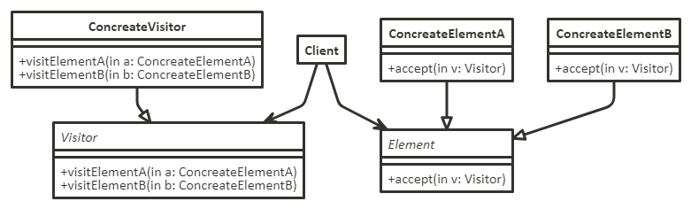

**Участники**:
- `Visitor` - посетитель:
    - объявляет операцию `visit` для каждого класса `ConcreteElement` в структуре объектов. Имя и сигнатура этой операции идентифицируют класс, который посылает посетителю запрос `visit`. Это позволяет посетителю определить, элемент какого конкретного класса он посещает. Владея такой информацией, посетитель может обращаться к элементу напрямую через его интерфейс;
    `ConcreteVisitor` - конкретный посетитель:
    - реализует все операции, объявленные в классе `Visitor`. Каждая операция реализует фрагмент алгоритма, определенного для класса соответствующего объекта в структуре. Класс `ConcreteVisitor` предоставляет контекст для этого алгоритма и сохраняет его локальное состояние. Часто в этом состоянии аккумулируются результаты, полученные в процессе обхода структуры;
- `Element` - элемент:
    - определяет операцию `accept`, которая принимает посетителя в качестве аргумента;
- `ConcreteElement` - конкретный элемент:
    - реализует операцию `accept`, принимающую посетителя как аргумент;
- `ObjectStructure` - структура объектов:
    - может перечислить свои элементы;
    - может предоставить посетителю высокоуровневый интерфейс для посещения своих элементов;
    - может быть как составным объектом, так и коллекцией, например списком или множеством.

**Отношения**:
- клиент, использующий паттерн посетитель, должен создать объект класса `ConcreteVisitor`, а затем обойти всю структуру, посетив каждый ее элемент;
- при посещении элемента последний вызывает операцию посетителя, соответствующую своему классу. Элемент передает этой операции себя в качестве аргумента, чтобы посетитель мог при необходимости получить доступ к его состоянию.

**Плюсы**:
- упрощает добавление новых операций. С помощью посетителей легко добавлять операции, зависящие от компонентов сложных объектов. Для определения новой операции над структурой объектов достаточно просто ввести нового посетителя;
- объединяет родственные операции и отсекает те, которые не имеют к ним отношения. Родственное поведение не разносится по всем классам, присутствующим в структуре объектов, оно локализовано в посетителе;
- посещение различных иерархий классов. Посетителю разрешено посещать объекты, не имеющие общего родительского класса. В интерфейс класса `Visitor` можно добавить операции для объектов любого типа;
- аккумулирование состояния. Посетители могут аккумулировать информацию о состоянии при посещении объектов структуры.

**Минусы**:
- добавление новых классов `ConcreteElement` затруднено. Каждый новый конкретный элемент требует объявления новой абстрактной операции в классе `Visitor`, которую нужно реализовать в каждом из существующих классов `ConcreteVisitor`;
- нарушение инкапсуляции. Применение посетителей подразумевает, что у класса `ConcreteElement` достаточно развитый интерфейс для того, чтобы посетители могли справиться со своей работой.

[Пример паттерна Посетитель]()

### <a id="Паттерн-Стратегия-Strategy" href="#Паттерн-Стратегия-Strategy">Паттерн Стратегия (Strategy)</a> [<a id="Содержание" href="#Содержание">Содержание</a>]

*Шаблон "Стратегия" позволяет переключаться между алгоритмами или стратегиями в зависимости от ситуации.*

Шаблон "Стратегия" позволяет при выполнении выбирать поведение алгоритма.

**Назначение**

Определяет семейство алгоритмов, инкапсулирует каждый из них и делает их взаимозаменяемыми. Стратегия позволяет изменять алгоритмы независимо от клиентов, которые ими пользуются. Он позволяет модифицировать алгоритмы независимо от их использования на стороне клиента. Поведение инкапсулируется в отдельном наборе классов, который легко расширяется и изменяется даже во время выполнения.

**Применимость**:
- когда имеется много родственных классов, отличающихся только поведением. Стратегия позволяет сконфигурировать класс, задав одно из возможных поведений;
- когда вам нужно иметь несколько разных вариантов алгоритма. Например, можно определить два варианта алгоритма, один из которых требует больше времени, а другой - больше памяти. Стратегии разрешается применять, когда варианты алгоритмов реализованы в виде иерархии классов;
- когда в алгоритме содержатся данные, о которых клиент не должен "знать". Используется, чтобы не раскрывать сложные, специфичные для алгоритма структуры данных;
- когда в классе определено много поведений, что представлено разветвленными условными операторами. В этом случае проще перенести код из ветвей в отдельные классы стратегий.

**Изображение**

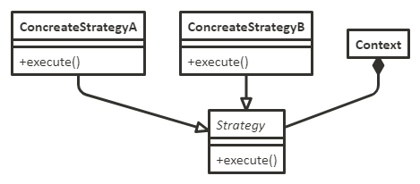

**Участники**:
- `Strategy` - стратегия:
    - объявляет общий для всех поддерживаемых алгоритмов интерфейс. Класс `Context` пользуется этим интерфейсом для вызова конкретного алгоритма, определенного в классе `ConcreteStrategy`;
- `ConcreteStrategy` - конкретная стратегия:
    - реализует алгоритм, использующий интерфейс, объявленный в классе `Strategy`;
- `Context` - контекст:
    - конфигурируется объектом класса `ConcreteStrategy`;
    - хранит ссылку на объект класса `Strategy`;
    - может определять интерфейс, который позволяет объекту `Strategy` получить доступ к данным контекста.

**Отношения**:
- классы `Strategy` и `Context` взаимодействуют для реализации выбранного алгоритма. Контекст может передать стратегии все необходимые алгоритму данные в момент его вызова. Вместо этого контекст может позволить обращаться к своим операциям в нужные моменты, передав ссылку на самого себя операциям класса `Strategy`;
- контекст переадресует запросы своих клиентов объекту-стратегии. Обычно клиент создает объект `ConcreteStrategy` и передает его контексту, после чего клиент "общается" исключительно с контекстом. Часто в распоряжении клиента находится несколько классов `ConcreteStrategy`, которые он может выбирать.

**Плюсы**:
- семейства родственных алгоритмов. Иерархия классов `Strategy` определяет семейство алгоритмов или поведений, которые можно повторно использовать в разных контекстах;
- альтернатива порождению подклассов. Избавляет от порождения от `Context` подклассов с различными поведениями и разделяет контекст от алгоритмов;
- с помощью стратегий можно избавиться от условных операторов;
- выбор реализации. Стратегии могут предлагать различные реализации одного и того же поведения. Клиент вправе выбирать подходящую стратегию в зависимости от своих требований к быстродействию и памяти.

**Минусы**:
- клиенты должны "знать" о различных стратегиях. Потенциальный недостаток этого паттерна в том, что для выбора подходящей стратегии клиент должен понимать, чем отличаются разные стратегии;
- обмен информацией между стратегией и контекстом. Интерфейс класса `Strategy` разделяется всеми подклассами `ConcreteStrategy` - неважно, сложна или тривиальна их реализация. Поэтому вполне вероятно, что некоторые стратегии не будут пользоваться всей передаваемой им информацией, особенно простые;
- увеличение числа объектов. Применение стратегий увеличивает число объектов в приложении. Иногда эти издержки можно сократить, если реализовать стратегии в виде объектов без состояния, которые могут разделяться несколькими контекстами.

[Пример паттерна Стратегия](../assets/Patterns/Strategy.js)

### <a id="Паттерн-Состояние-State" href="#Паттерн-Состояние-State">Паттерн Состояние (State)</a> [<a id="Содержание" href="#Содержание">Содержание</a>]

*Шаблон позволяет менять поведение класса при изменении состояния.*

Шаблон "Состояние" реализует машину состояний объектно ориентированным способом. Это достигается с помощью:
- реализации каждого состояния в виде производного класса интерфейса шаблона "Состояние";
- реализации переходов состояний (state transitions) посредством вызова методов, определённых вышестоящим классом (superclass).

Шаблон "Состояние" - это в некотором плане шаблон "Стратегия", при котором возможно переключение текущей стратегии с помощью вызова методов, определённых в интерфейсе шаблона.

**Назначение**

Позволяет объекту варьировать свое поведение в зависимости от внутреннего состояния. Извне создается впечатление, что изменился класс объекта.

**Применимость**:
- когда поведение объекта зависит от его состояния и должно изменяться во время выполнения;
- когда в коде операций встречаются состоящие из многих ветвей условные операторы, в которых выбор ветви зависит от состояния. Обычно в таком случае состояние представлено перечисляемыми константами. Часто одна и та же структура условного оператора повторяется в нескольких операциях. Паттерн состояние предлагает поместить каждую ветвь в отдельный класс. Это позволяет трактовать состояние объекта как самостоятельный объект, который может изменяться независимо от других.

**Изображение**

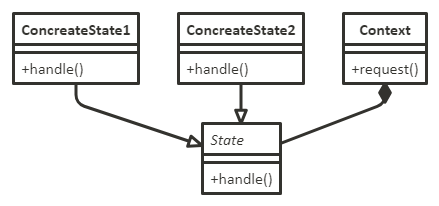

**Участники**:
- `Context` - контекст:
    - определяет интерфейс, представляющий интерес для клиентов;
    - хранит экземпляр подкласса `ConcreteState`, которым определяется текущее состояние;
- `State` - состояние:
    - определяет интерфейс для инкапсуляции поведения, ассоциированного  с конкретным состоянием контекста `Context`;
- подклассы `ConcreteState` - конкретное состояние:
    - каждый подкласс реализует поведение, ассоциированное с некоторым состоянием контекста `Context`.

**Отношения**:
- класс `Context` делегирует зависящие от состояния запросы текущему объекту `ConcreteState`;
- контекст может передать себя в качестве аргумента объекту `State`, который будет обрабатывать запрос. Это дает возможность объекту-состоянию при необходимости получить доступ к контексту;
- `Context` - это основной интерфейс для клиентов. Клиенты могут конфигурировать контекст объектами состояния `State`. Один раз сконфигурировав контекст, Клиенты уже не должны напрямую связываться с объектами состояния;
- либо `Context`, либо подклассы `ConcreteState` могут решить, при какихусловиях и в каком порядке происходит смена состояний.

**Плюсы**:
- локализует зависящее от состояния поведение и делит его на части, соответствующие состояниям. Паттерн состояние помещает все поведение, ассоциированное с конкретным состоянием, в отдельный объект. Поскольку зависящий от состояния код целиком находится в одном из подклассов класса `State`, то добавлять новые состояния и переходы можно просто путем порождения новых подклассов;
- делает явными переходы между состояниями;
- объекты состояния можно разделять. Если в объекте состояния `State` отсутствуют переменные экземпляра, то есть представляемое им состояние кодируется исключительно самим типом, то разные контексты могут разделять один и тот же объект `State`.

[Пример паттерна Состояние](../assets/Patterns/State.js)

### <a id="Паттерн-Шаблонный-метод-Template-method" href="#Паттерн-Шаблонный-метод-Template-method">Паттерн Шаблонный метод (Template method)</a> [<a id="Содержание" href="#Содержание">Содержание</a>]

*"Шаблонный метод" определяет каркас выполнения определённого алгоритма, но реализацию самих этапов делегирует дочерним классам.*

"Шаблонный метод" - это поведенческий шаблон, определяющий основу алгоритма и позволяющий наследникам переопределять некоторые шаги алгоритма, не изменяя его структуру в целом.

**Назначение**

Шаблонный метод определяет основу алгоритма и позволяет подклассам переопределить некоторые шаги алгоритма, не изменяя его структуру в целом.

**Применимость**:
- чтобы однократно использовать инвариантные части алгоритма, оставляя реализацию изменяющегося поведения на усмотрение подклассов;
- когда можно вычленить и локализовать в одном классе поведение, общее для всех подклассов, дабы избежать дублирования кода. Сначала идентифицируются различия в существующем коде, а затем они выносятся в отдельные операции. В конечном итоге различающиеся фрагменты кода заменяются шаблонным методом, из которого вызываются новые операции;
- для управления расширениями подклассов. Можно определить шаблонный метод так, что он будет вызывать операции-зацепки - в определенных точках, разрешив тем самым расширение только в этих точках.

**Изображение**

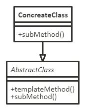

**Участники**:
- `AbstractClass` - абстрактный класс:
    - определяет абстрактные примитивные операции, замещаемые в конкретных подклассах для реализации шагов алгоритма;
    - реализует шаблонный метод, определяющий скелет алгоритма. Шаблонный метод вызывает примитивные операции, а также операции, определенные в классе `AbstractClass` или в других объектах;
- `ConcreteClass` - конкретный класс:
    - реализует примитивные операции, выполняющие шаги алгоритма способом, который зависит от подкласса.

**Отношения**:
- `ConcreteClass` предполагает, что инвариантные шаги алгоритма будут выполнены в `AbstractClass`.

**Плюсы**:
- предоставляют возможность вынести общее поведение в подклассы.

[Пример паттерна Шаблонный метод](../assets/Patterns/TemplateMethod.js)

## <a id="Составные-паттерны" href="#Составные-паттерны">Составные паттерны</a> [<a id="Содержание" href="#Содержание">Содержание</a>]

### <a id="Паттерн-Модель-Представление-Контроллер" href="#Паттерн-Модель-Представление-Контроллер">Паттерн Модель-Представление-Контроллер</a> [<a id="Содержание" href="#Содержание">Содержание</a>]

Схема разделения данных приложения, пользовательского интерфейса и управляющей логики на три отдельных компонента: модель, представление и контроллер - таким образом, что модификация каждого компонента может осуществляться независимо.

**Изображение**

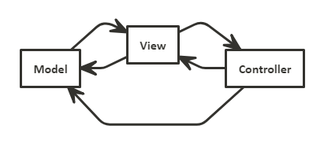

**Участники**:
- `Модель` - хранит все данные, информацию состояния и логику приложения. Она не знает о существовании представления и контроллера, хотя и предоставляет интерфейс для получения/изменения состояния, а также может отправлять оповещения об изменениях состояния наблюдателям;
- `Представление` - определяет представление модели. Как правило, представление получает состояние и данные для отображения непосредственно от модели;
- `Контроллер` - получает данные, вводимые пользователем, и определяет их смысл для модели. Ответственны лишь за:
    - приём запроса от пользователя;
    - анализ запроса;
    - выбор следующего действия системы, соответственно результатам анализа (например, передача запроса другим элементам системы).

**Отношения**:
1. **Пользователь взаимодействует с моделью**. `Представление` - "окно", через которое пользователь воспринимает модель. Когда делается что-то с представлением, представление сообщает `контроллеру`, какая операция была выполнена. `Контроллер` должен обработать это действие;
2. **Контроллер обращается к модели с запросами об изменении состояния**. `Контроллер` получает действия пользователя и интерпретирует их. Если действие происходит на `представлении`, то `контроллер` должен разобраться, что это значит и какие операции с `моделью` должны быть выполнены при данном действии;
3. **Контроллер также может обратиться к представлению с запросом об изменении**. Когда `контроллер` получает действие от представления, в результате его обработки он может обратиться к `представлению` с запросом на изменение;
4. **Модель оповещает представление об изменении состояния**. Когда в `модели` что-то изменяется (вследствие действий пользователя или других внутренних изменений), модель оповещает представление об изменении состояния;
5. **Представление запрашивает у модели информацию состояния**. `Представление` получает отображаемую информацию состояния непосредственно от `модели`. Например, когда модель оповещает `представление`, `представление` запрашивает данные и отображает их. `Представление` также может запросить у `модели` информацию состояния в результате запроса на изменение состояния со стороны `контроллера`.

**Включаемые паттерны**:
- **стратегия** - `Представление` и `контроллер` реализуют этот классический паттерн. `Представление` - объект со сменной стратегией, `контроллер` эту стратегию предоставляет. `Представление` интересуют только визуальные аспекты приложения, а все решения относительно поведения интерфейса делегируются `контроллеру`. Применение паттерна Стратегия также сохраняет логическую изоляцию `представления` от `модели`, потому что все взаимодействия с `моделью` для выполнения пользовательских запросов осуществляются `контроллером`. `Представлению` о них ничего не известно;
- **компоновщик** - представление является комбинацией компонентов GUI. Когда `контроллер` приказывает представлению обновиться, он обращается к верхнему компоненту, а паттерн Компоновщик делает все остальное;
- **наблюдатель** - `Модель` реализует паттерн Наблюдатель для оповещения заинтересованных объектов об изменениях состояния. Паттерн Наблюдатель обеспечивает полную независимость `модели` от `представлений` и `контроллеров`. Он позволяет использовать разные `представления` с одной `моделью`, или даже несколько `представлений` одновременно.

[Пример паттерна MVC](../assets/Patterns/MVC.js)

<a id="Принципы-проектирования" href="#Принципы-проектирования">Принципы проектирования</a> [<a id="Содержание" href="#Содержание">Содержание</a>]
=======================

## <a id="SOLID" href="#SOLID">SOLID</a> [<a id="Содержание" href="#Содержание">Содержание</a>]

Мнемонический акроним, введённый Майклом Фэзерсом для первых пяти принципов, названных Робертом Мартином в начале 2000-х, которые означали пять основных принципов объектно-ориентированного программирования и проектирования.

Эти принципы, когда применяются вместе, предназначены для повышения вероятности того, что программист создаст систему, которую будет легко поддерживать и расширять в течение долгого времени. Принципы SOLID - это руководства, которые могут применяться во время работы над программным обеспечением для удаления "кода с запашком" предписывая программисту выполнять рефакторинг исходного кода, пока тот не станет разборчиво написанным и расширяемым. Это часть общей стратегии гибкой и адаптивной разработки.

### <a id="Принцип-единственной-ответственности-Single-Responsibility-Principle-SRP" href="#Принцип-единственной-ответственности-Single-Responsibility-Principle-SRP">Принцип единственной ответственности (Single Responsibility Principle, SRP)</a> [<a id="Содержание" href="#Содержание">Содержание</a>]

Для изменения класса никогда не должно быть более одной причины.

Обозначает, что каждый объект должен иметь одну ответственность и эта ответственность должна быть полностью инкапсулирована в класс. Все его поведения должны быть направлены исключительно на обеспечение этой ответственности. К примеру класс не должен манипулировать свойствами и одновременно отвечать за работу с хранилищем данных этого класса.

Принцип SRP можно применить только в том случае, когда:
- объекту класса становится позволительно слишком много;
- доменная логика концентрируется только в одном классе;
- любое изменение логики поведения объекта приводит к изменениям в других местах приложения, где это не подразумевалось изначально;
- приходится тестировать, исправлять ошибки, компилировать различные места приложения, даже если за их работоспособность отвечает третья сторона;
- невозможно легко отделить и применить класс в другой сфере приложения, так как это потянет ненужные зависимости.

Правильное применение принципа единственной ответственности приводит к высокой степени связности элементов внутри модуля, то есть к тому, что задачи, решаемые внутри него, хорошо соответствуют его главной цели.

### <a id="Принцип-открытостизакрытости-OpenClosed-Principle-OCP" href="#Принцип-открытостизакрытости-OpenClosed-Principle-OCP">Принцип открытости/закрытости (Open/Closed Principle, OCP)</a> [<a id="Содержание" href="#Содержание">Содержание</a>]

**Программные сущности** (классы, модули, функции и т. д.) должны быть открыты для расширения, но закрыты для модифицирования.

Принцип открытости/закрытости означает, что программные сущности должны быть:
- открыты для расширения: означает, что поведение сущности может быть расширено путём создания новых типов сущностей;
- закрыты для изменения: в результате расширения поведения сущности, не должны вноситься изменения в код, который эти сущности использует.

### <a id="Принцип-подстановки-Барбары-Лисков-Liskov-Substitution-Principle-LSP" href="#Принцип-подстановки-Барбары-Лисков-Liskov-Substitution-Principle-LSP">Принцип подстановки Барбары Лисков (Liskov Substitution Principle, LSP)</a> [<a id="Содержание" href="#Содержание">Содержание</a>]

Если `S` - это подтип `Т`, то объекты типа `Т` могут быть заменены объектами типа `S` (например, вместо объектов типа `Т` можно подставить объекты типа `S`) без изменения каких-либо свойств программы (корректность, задачи и т. д.).

Также принцип LSP подразумевает, что методы подкласса не могут генерировать никаких дополнительных исключений, кроме тех, которые сами являются подклассами исключений, генерируемых методами надкласса.

Функции, которые используют ссылки на базовые классы, должны иметь возможность использовать объекты производных классов, не зная об этом.

### <a id="Принцип-разделения-интерфейса-Interface-Segregation-Principle-ISP" href="#Принцип-разделения-интерфейса-Interface-Segregation-Principle-ISP">Принцип разделения интерфейса (Interface Segregation Principle, ISP)</a> [<a id="Содержание" href="#Содержание">Содержание</a>]

Клиенты не должны зависеть от интерфейсов, которые не используют.

Клиенты не должны зависеть от методов, которые они не используют. Принцип разделения интерфейсов говорит о том, что слишком "толстые" интерфейсы необходимо разделять на более маленькие и специфические, чтобы клиенты маленьких интерфейсов знали только о методах, которые необходимы им в работе. В итоге, при изменении метода интерфейса не должны меняться клиенты, которые этот метод не используют.

### <a id="Принцип-инверсии-зависимостей-Dependency-Inversion-Principle-DIP" href="#Принцип-инверсии-зависимостей-Dependency-Inversion-Principle-DIP">Принцип инверсии зависимостей (Dependency Inversion Principle, DIP)</a> [<a id="Содержание" href="#Содержание">Содержание</a>]

Объектом зависимости должна быть абстракция, а не что-то конкретное.

Этот принцип гласит:
- высокоуровневые модули не должны зависеть от низкоуровневых. Оба вида должны зависеть от абстракций;
- абстракции не должны зависеть от деталей. Детали должны зависеть от абстракций.

## <a id="KISS-Keep-it-short-and-simple" href="#KISS-Keep-it-short-and-simple">KISS (Keep it short and simple)</a> [<a id="Содержание" href="#Содержание">Содержание</a>]

keep it simple, stupid - "делай это проще, тупой"

Принцип, запрещающий использование более сложных средств, чем необходимо. Принцип декларирует простоту системы в качестве основной цели и/или ценности.

## <a id="Чем-хуже-тем-лучше" href="#Чем-хуже-тем-лучше">Чем хуже, тем лучше</a> [<a id="Содержание" href="#Содержание">Содержание</a>]

Подход к разработке программного обеспечения, объявляющий простоту реализации и простоту интерфейса более важными, чем любые другие свойства системы.

Описывается этот подход так:
- **простота** - реализация и интерфейс должны быть простыми. Простота реализации даже несколько важнее простоты интерфейса. Простота - самое важное требование при выборе дизайна;
- **правильность** - дизайн должен быть правильным во всех видимых проявлениях. Простой дизайн немного лучше, чем правильный;
- **логичность** (последовательность) - дизайн не должен быть слишком нелогичным. Иногда можно пожертвовать логичностью ради простоты, но лучше отказаться от тех частей дизайна, которые полезны лишь в редких случаях, чем усложнить реализацию или пожертвовать логичностью;
- **полнота** - дизайн должен охватывать как можно больше важных ситуаций. Полнотой можно жертвовать в пользу остальных качеств и обязательно нужно жертвовать, если она мешает простоте. Логичностью можно жертвовать в пользу полноты, если сохраняется простота (особенно бесполезна логичность интерфейса).

## <a id="DRY-Dont-repeat-yourself" href="#DRY-Dont-repeat-yourself">DRY (Don’t repeat yourself)</a> [<a id="Содержание" href="#Содержание">Содержание</a>]

Принцип разработки программного обеспечения, нацеленный на снижение повторения информации различного рода, особенно в системах со множеством слоёв абстрагирования. Принцип DRY формулируется как: "*Каждая часть знания должна иметь единственное, непротиворечивое и авторитетное представление в рамках системы*".

## <a id="YAGNI-You-aint-gonna-need-it" href="#YAGNI-You-aint-gonna-need-it">YAGNI (You ain't gonna need it)</a> [<a id="Содержание" href="#Содержание">Содержание</a>]

Процесс и принцип проектирования ПО, при котором в качестве основной цели и/или ценности декларируется отказ от избыточной функциональности, - то есть отказ добавления функциональности, в которой нет непосредственной надобности.

## <a id="GIGO-Garbage-In-Garbage-Out" href="#GIGO-Garbage-In-Garbage-Out">GIGO (Garbage In, Garbage Out)</a> [<a id="Содержание" href="#Содержание">Содержание</a>]

Принцип в информатике, означающий, что при неверных входящих данных будут получены неверные результаты, даже если сам по себе алгоритм правилен.

<a id="REST" href="#REST">REST</a> [<a id="Содержание" href="#Содержание">Содержание</a>]
====

(**Representational State Transfer** - *"передача состояния представления"*)

Архитектурный стиль взаимодействия компонентов распределённого приложения в сети. **REST** представляет собой согласованный набор ограничений, учитываемых при проектировании распределённой гипермедиа-системы. В определённых случаях это приводит к повышению производительности и упрощению архитектуры.

В широком смысле компоненты в **REST** взаимодействуют наподобие взаимодействия клиентов и серверов во Всемирной паутине. **REST** является альтернативой **RPC**.

В сети Интернет вызов удалённой процедуры может представлять собой обычный **HTTP**-запрос (обычно "**GET**" или "**POST**"; такой запрос называют "**REST-запрос**"), а необходимые данные передаются в качестве параметров запроса.

## <a id="HTTP-методы" href="#HTTP-методы">HTTP методы</a> [<a id="Содержание" href="#Содержание">Содержание</a>]

**HTTP** глаголы составляют основную часть "единого интерфейса", ограничивающего и предоставляющего возможность осуществлять действия над существительным-ресурсом. Основными или наиболее часто используемыми HTTP глаголами (методами) являются **POST**, **GET**, **PUT**, и **DELETE**. Они соответствуют операциям создания, чтения, обновления и удаления (или в совокупности - **CRUD**). Есть еще и другие глаголы, но они используются реже. Из реже используемых методов выделяются **OPTIONS** и **HEAD**.

### <a id="Метод-GET" href="#Метод-GET">Метод **GET**</a> [<a id="Содержание" href="#Содержание">Содержание</a>]

**HTTP** метод **GET** используется для получения (или чтения) представления ресурса. В случае *"удачного"* (или не содержащего ошибок) адреса, **GET** возвращается представление ресурса в формате **XML** или **JSON** в сочетании с кодом состояния **HTTP** **200** (OK). В случае наличия ошибок обычно возвращается код **404** (NOT FOUND) или **400** (BAD REQUEST).

В соответствии спецификации **HTTP**, **GET** (также как и **HEAD**) запросы используются только для чтения данных, не изменя их. **GET** (а также **HEAD**) запросы являются **идемпотентными** (тождественными), что подразумевает получение идеинтичных данных при использовании одних и теж же запросов (как при единичном обращении, так и при многократном).

Не стоит использовать **GET** для небезопасных операций над данными, при данном запросе они не должны быть модифицированы.

### <a id="Метод-PUT" href="#Метод-PUT">Метод **PUT**</a> [<a id="Содержание" href="#Содержание">Содержание</a>]

Метод **PUT** обычно используется для предоставления возможности обновления ресурса. Тело запроса при отправке **PUT**-запроса к существующему ресурсу **URI** должно содержать обновленные данные оригинального ресурса (полностью, или только обновляемую часть).

Кроме того, **PUT** может быть использован для создания ресурса, в случае, когда идентификатор ресурса выбирает клиент, а не сервер (при отправке **PUT** запроса по адресу, содержащему не существующий идентификатор ресурса). Тело запроса должно быть модификацией оригинального ресурса.

Для создания новых экземпляров ресурса предпочтительнее использозвание **POST** запроса. В данном случае, при создании экземпляра будет предоставлен корректный идентфикатор экземпляра ресурса в возвращенных данных об экземпляре.

При успешном обновлении посредством выполнения **PUT** запроса возвращается код **200** (или **204** если не был передан какой либо контент в теле ответа). Если **PUT** используется для создания экземпляра - обычно возвращают **HTTP** код **201** при успешном создании. Возвращать данные в ответ на запрос не обязательно. Также не обязательно возвращать ссылку на экземпляр ресурса посредством заголовка `Location` по причине того, что клиент и так обладает идентификатором экземпляра ресурса.

**PUT** не безопасная операция, так как в следствии ее выполнения происходит модификация (или создание) экземпляров ресурса на стороне сервера, но этот метод идемпотентен (создание или обновление ресурса посредством отправки **PUT** запроса - ресурс не исчезнет, будет располагаться там же, где и был при первом обращении, а также, многократное выполнение одного и того же **PUT** запроса не изменит общего состояния системы, за исключением первого раза).

Если **PUT** запрос используется для увеличесния счетчика просмотра конкретного ресурса - данный запрос уже не считается идемпотентным. Иногда такое происходит и считается достаточным задокументировать тот факт, что вызов не идемпотентен. Однако, строго рекомендуется выдерживать идемпотентность **PUT** запроса.

### <a id="Метод-POST" href="#Метод-POST">Метод **POST**</a> [<a id="Содержание" href="#Содержание">Содержание</a>]

Метод **POST** наиболее часто используется для создания новых ресурсов. Используется для создания вложенных ресурсов (при создании нового ресурса, **POST** запрос отправляется к родительскому ресурсу и, таким образом, сервис берет на себя ответственность на установление связи создаваемого ресурса с родительским ресурсом, назначение новому ресурсу ID и т.п.)
При успешном создании ресурса возвращается **HTTP** код **201**, а также в заголовке `Location` передается адрес созданного ресурса.

**POST** не является безопасным или идемпотентным запросом. Потому рекомендуется его использование для не идемпотентных запросов. В результате выполнения идентичных **POST** запросов предоставляются сильно похожие, но не идеинтичные данные.

### <a id="Метод-DELETE" href="#Метод-DELETE">Метод **DELETE**</a> [<a id="Содержание" href="#Содержание">Содержание</a>]

Метод **DELETE** используется для удаления ресурса, идентифицированного конкретным **URI** (ID).

При успешном удалении возвращается **200** (OK) код **HTTP**, совместно с телом ответа, содаржащим данные удаленного ресурса (отрицательно сказывается на экономии трафика) или завернутые ответы. Также возможно использование HTTP кода **204** (NO CONTENT) без тела ответа.

Согласно спецификации **HTTP**, **DELETE** запрос идемпотентен. Если выполняется **DELETE** запрос к ресурсу, он удаляется. Повторный **DELETE** запрос к ресурсу закончится также: ресурс удален. Если **DELETE** запрос используется для декремента счетчика, **DELETE** запрос не является идемпотентным. Необходимо использовать **POST** для не идемпотентых операций.

Повторный **DELETE** запрос к ресурсу часто сопровождается **404** (NOT FOUND) кодом **HTTP** по причине того, что ресурс уже удален и более не доступен. Это делает **DELETE** операцию не идемпотентной, но это общепринятый компромисс на тот случай, если ресурс был удален, а не помечен, как удаленный.

## <a id="Именование-ресурсов" href="#Именование-ресурсов">Именование ресурсов</a> [<a id="Содержание" href="#Содержание">Содержание</a>]

За основу адресации берется покрытие уникальными идентификаторами ресурсов (**URI**). У каждого ресурса есть свой адрес или **URI**: вся интересная информация, которую сервер может предоставить, представлена как ресурс. Ограничение однообразия интерфейса частично реализовано с помощью комбинаций **URI** и **HTTP** глаголов и их использованием в соответствии со стандартами и конвенциями.

Ресурсы необходимо называть **существительными**, в противоположность глаголам, или действиям (**URI** должен ссылаться на ресурс, а не на действие).

**URI** должны иметь предсказуемую, иерархичную структуру, чтобы увеличить понятность и, как следствие, юзабилити: предсказуемость означает, что они консистентны, иерархичность означает, что у данных есть структура взаомоотношений. Это не принцип и не ограничение **REST**, но это улучшает **API**.

**RESTful API** пишут для потребителей. Назавания и струтрука **URI** должна передавать смысл этим потребителям.

### <a id="Наименование-ресурса" href="#Наименование-ресурса">Наименование ресурса</a> [<a id="Содержание" href="#Содержание">Содержание</a>]

`GET /<имя_ресурса>` - возвращает список ресурсов.  
`POST /<имя_ресурса> `- создает новый экземпляр ресурса.  
`GET /<имя_ресурса>/<идентификатор>` - возвращает ресурс из коллекции по указанному идентификатору.  
`GET|PUT|DELETE /<имя_ресурса>/<идентификатор>` - читает, обновляет, удаляет ресурс с указанным идентификатором.

### <a id="Взаимодействие-с-подресурсом-ресурса" href="#Взаимодействие-с-подресурсом-ресурса">Взаимодействие с подресурсом ресурса</a> [<a id="Содержание" href="#Содержание">Содержание</a>]

`GET /<имя_ресурса>/<идентификатор>/<имя_подресурса>` - возвращает список подресурсов, который связан с указанным ресурсом по указанному идентификатору.  
`POST /<имя_ресурса>/<идентификатор>/<имя_подресурса>` - создает новый экземпляр подресурса, который связан с указанным ресурсом по указанному идентификатору.  
`GET|PUT|DELETE /<имя_ресурса>/<идентификатор>/<имя_подресурса>/<подидентификатор>` - читает, обновляет, удаляет подресурс ресурса с указанным идентификатором.

Так же можно продолжать концепцию иерархичности ресурсом и подресурсов. Для разбиения подвложености, доступ к подресурсу можно выносить вотдельно.

## <a id="Идемпотентность" href="#Идемпотентность">Идемпотентность</a> [<a id="Содержание" href="#Содержание">Содержание</a>]

Это свойство объекта или операции при повторном применении операции к объекту давать тот же результат, что и при первом.

С точки зрения **RESTful**-сервиса, операция (или вызов сервиса) идемпотентна тогда, когда клиенты могут делать один и тот же вызов неоднократно при одном и том же результате.
В то время, как идемпотентные операции производят один и тот же результат на сервере (побочные эффекты), ответ сам по себе может не быть тем же самым (например, состояние ресурса может измениться между запросами).

## <a id="Безопасность" href="#Безопасность">Безопасность</a> [<a id="Содержание" href="#Содержание">Содержание</a>]

Некоторые **HTTP**-методы (**HEAD**, **GET**, **OPTIONS**, **TRACE** и др.) определены как безопасные, это означает, что они предназначены только для получения информации и не должны изменять состояние сервера (они не должны иметь побочных эффектов, за исключением безобидных эффектов, таких как: логирование, кеширование, показ баннерной рекламы или увеличение веб-счетчика). Созданный произвольный **GET**-запрос, который не учитывает контекст состояния приложения, следует считать безопасным.

Безопасность означает, что вызов метода не имеет побочных эффектов. Следовательно, такие (безопасные) запросы клиенты могут безопасно совершать неоднократно, не опасаясь изменить состояние сервера.

По определению, безопасные операции идемпотентны, так как они приводят к одному и тому же результату на сервере.

Безопасные методы реализованы как операции только для чтения. Однако безопасность не означает, что сервер должен возвращать тот же самый результат каждый раз.

<a id="Рекомендации-по-проектированию-HTTP-API" href="#Рекомендации-по-проектированию-HTTP-API">Рекомендации по проектированию HTTP API</a> [<a id="Содержание" href="#Содержание">Содержание</a>]
=======================================

## <a id="Основные-принципы" href="#Основные-принципы">Основные принципы</a> [<a id="Содержание" href="#Содержание">Содержание</a>]

### <a id="Принцип-разделения-ответственности" href="#Принцип-разделения-ответственности">Принцип разделения ответственности</a> [<a id="Содержание" href="#Содержание">Содержание</a>]

Необходимо стараться сохранять простоту системы, разделяя ответственность между различными частями цикла "запрос-ответ". Запросы и ответы выполняются для получения доступа к определенному ресурсу или набору ресурсов. Для определения сущности, которую необходимо получить, нужно использовать путь и тело ответа для передачи содержимого, а заголовки - для передачи метаданных.

### <a id="Требование-использования-защищенных-соединений" href="#Требование-использования-защищенных-соединений">Требование использования защищенных соединений</a> [<a id="Содержание" href="#Содержание">Содержание</a>]

Для получения данных при помощи API нужно использовать только защищенные соединения с TLS.

Перенаправления не приветствуются, поскольку они допускают некорректное поведение клиента, не предоставляя при этом никаких четких объяснений. Клиенты, которые полагаются на редиректы, удваивают таким образом трафик сервера и использование TLS в этом случае бесполезно, поскольку важные данные оказываются незащищенными при первом вызове.

### <a id="Требование-наличие-версии-в-заголовке-Accept" href="#Требование-наличие-версии-в-заголовке-Accept">Требование наличие версии в заголовке `Accept`</a> [<a id="Содержание" href="#Содержание">Содержание</a>]

Наличие нескольких версий и переходы между ними может быть одним из самых сложных аспектов проектирования и использования API.

Для того, чтобы клиент не пользовался нестабильным API, лучше всего проверять наличие его версии в каждом запросе. При этом стоит избегать указания версии по умолчанию, поскольку это значительно усложняет заголовок, и эта версия также может меняться в будущем.
Лучше всего - добавить версию в заголовок вместе с другими метаданными, используя заголовок `Accept` с пользовательским типом содержимого:  
`Accept: application/vnd.heroku+json; version=3`

### <a id="Использовать-заголовок-ETags-для-кеширования" href="#Использовать-заголовок-ETags-для-кеширования">Использовать заголовок `ETags` для кеширования</a> [<a id="Содержание" href="#Содержание">Содержание</a>]

Необходимо включать заголовок `ETags` во все запросы, определяя при этом версию возвращаемого ресурса. Это позволит пользователям кэшировать ресурсы и реализовывать условные запросы при помощи использования заголовка `If-None-Match`, который поможет определить, нужно обновлять кэш или нет.

### <a id="Использовать-Request-ID-для-интроспекции" href="#Использовать-Request-ID-для-интроспекции">Использовать `Request-ID` для интроспекции</a> [<a id="Содержание" href="#Содержание">Содержание</a>]

Необходимо включать заголовок `Request-Id`, содержащий в себе **UUID** (*Universally Unique Identifier* - представляет собой 16-байтный (128-битный) номер) значение, в каждый ответ сервера. Регистрируя эти значения на клиенте, сервере или другом сервисе, вы получаете возможность отлаживать и диагностировать проблемы, связанные с запросами.

### <a id="Необходимо-разбивать-большие-ответы-сервера-на-несколько-небольших-при-помощи-заголовка-Range" href="#Необходимо-разбивать-большие-ответы-сервера-на-несколько-небольших-при-помощи-заголовка-Range">Необходимо разбивать большие ответы сервера на несколько небольших при помощи заголовка `Range`</a> [<a id="Содержание" href="#Содержание">Содержание</a>]

Большие ответы необходимо разбивать на более мелкие, используя заголовок `Range`.

## <a id="Запросы" href="#Запросы">Запросы</a> [<a id="Содержание" href="#Содержание">Содержание</a>]

### <a id="Соответствующие-коды-состояний" href="#Соответствующие-коды-состояний">Соответствующие коды состояний</a> [<a id="Содержание" href="#Содержание">Содержание</a>]

Необходимо возвращать соотвествующий код состояния HTTP в каждом ответе.

**Успешные ответы должны содержать такие коды состояний**:
- **200** - **GET** запрос завершился успешно, синхронный **DELETE** или **PATCH** запрос завершился успешно или синхронный **PUT** запрос обновил существующий ресурс;
- **201** - синхронный **POST** запрос завершился, синхронный **PUT** запрос создал новый ресурс;
- **202** - принят **POST**, **PUT**, **DELETE** или **PATCH** запрос, который будет обработан асинхронно;
- **206** - **GET** запрос завершился успешно, но будет возвращен частичный ответ (заголовок `Range`).

**Состояния ошибок авторизации и аутентификации**:
- **401 Unauthorized** - запрос завершился с ошибкой, поскольку пользователь не прошел аутентификацию;
- **403 Forbidden** - запрос завершился с ошибкой, так как пользователь не авторизовался для получения доступа к определенному ресурсу;

**Коды ошибок для предоставления дополнительной информации об их причинах**:
- **422 Unprocessable Entity** - запрос был распознан, но содержит неверные параметры;
- **429 Too Many Requests** - превышен лимит запросов, попробуйте позже;
- **500 Internal Server Error** - проблема на стороне сервера, проверьте состояние сайта и/или сообщите о проблеме.

### <a id="Предоставление-полных-версии-ресурсов" href="#Предоставление-полных-версии-ресурсов">Предоставление полных версии ресурсов</a> [<a id="Содержание" href="#Содержание">Содержание</a>]

Необходимо возвращать пользователям **API** полное представление ресурса (то есть объект со всеми атрибутами) во всех ответах, где это возможно. Всегда необходимо предоставлять полную версию ресурса в ответах на запросы с кодами состояния **200** и **201**, включая **PUT**, **PATCH** и **DELETE** запросы.

Ответы на запросы с кодом состояния **202** не должны содержать все поля объекта.

### <a id="API-должен-принимать-сериализованный-JSON-в-теле-запроса" href="#API-должен-принимать-сериализованный-JSON-в-теле-запроса">API должен принимать сериализованный JSON в теле запроса</a> [<a id="Содержание" href="#Содержание">Содержание</a>]

API должен предусматривать возможность передачи сереализованного **JSON** в теле **PUT** / **PATCH** / **POST** запросов вместо, либо в дополнение к передаваемым данным формы. Таким образом создается симметрия в **JSON**-ответах.

## <a id="Конструировании-пути-к-ресурсу" href="#Конструировании-пути-к-ресурсу">Конструировании пути к ресурсу</a> [<a id="Содержание" href="#Содержание">Содержание</a>]

### <a id="Названия-ресурсов" href="#Названия-ресурсов">Названия ресурсов</a> [<a id="Содержание" href="#Содержание">Содержание</a>]

Необходимо использовать множественную форму названия ресурса, за исключением тех случаев, когда запрашиваемый ресурс в системе всегда один. Такой подход помогает сохранять единообразие при доступе к конкретному ресурсу.

### <a id="Действия" href="#Действия">Действия</a> [<a id="Содержание" href="#Содержание">Содержание</a>]

Необходимо проектировать такие конечные **url**, которые не требуют дополнительных действий для отдельных ресурсов. В случаях, когда это необходимо, добавляйте в общий путь компонент **"action"** для того, чтобы четко определить эти действия:  
`/resources/:resource/actions/:action`
> `/runs/{run_id}/actions/stop`

### <a id="Названия-компонентов-пути-и-атрибутов" href="#Названия-компонентов-пути-и-атрибутов">Названия компонентов пути и атрибутов</a> [<a id="Содержание" href="#Содержание">Содержание</a>]

Для названий компонентов пути к ресурсу необходимо использовать нижний регистр и разделять их при помощи дефиса.
> `service-api.com/app-setups`

Названия атрибутов лучше писать в нижнем регистре, а в качестве разделителя лучше использовать нижнее подчеркивание - таким образом названия полей можно писать без скобок в Javascript.
> `service_class: "first"`

### <a id="API-должен-поддерживать-доступ-к-ресурсу-не-только-по-его-id" href="#API-должен-поддерживать-доступ-к-ресурсу-не-только-по-его-id">API должен поддерживать доступ к ресурсу не только по его id</a> [<a id="Содержание" href="#Содержание">Содержание</a>]

В некоторых случаях для конечных пользователей неудобен доступ к ресурсу по его идентификатору. В таких случаях нужно организовать доступ как по имени, так и по идентификатору.
> `https://service.com/apps/{app_id_or_name}`  
> `https://service.com/apps/97addcf0-c182`  
> `https://service.com/apps/www-prod`

### <a id="Необходимо-свести-к-минимуму-количество-вложений-в-пути-для-доступа-к-ресурсу" href="#Необходимо-свести-к-минимуму-количество-вложений-в-пути-для-доступа-к-ресурсу">Необходимо свести к минимуму количество вложений в пути для доступа к ресурсу</a> [<a id="Содержание" href="#Содержание">Содержание</a>]

В моделях данных, в которых присутствуют родительские отношения между сущностями, пути доступа к ресурсам могут иметь большой уровень вложенности, чтобы ограничить глубину вложенности, необходимо размещать ресурсы в корневой директории. Вложенность лучше использовать для обозначения доступа к коллекциям ресурсов.

## <a id="Ответы" href="#Ответы">Ответы</a> [<a id="Содержание" href="#Содержание">Содержание</a>]

### <a id="Необходимо-предоставлять-UUID-запрашиваемых-ресурсов" href="#Необходимо-предоставлять-UUID-запрашиваемых-ресурсов">Необходимо предоставлять UUID запрашиваемых ресурсов</a> [<a id="Содержание" href="#Содержание">Содержание</a>]

У каждого ресурса по умолчанию должен быть атрибут **id**. В качестве значений идентификатора ресурса необходимо старатса всегда использовать **UUID**. Не нужно использовать идентификаторы, которые не будут уникальными в масштабе сервиса, особенно автоинкрементные идентификаторы.

**UUID** ресурса выводите в формате **8-4-4-4-12**.
> `"id": "01234567-89ab-cdef-0123-456789abcdef"`

### <a id="Необходимо-предоставлять-информацию-о-дате-создания-и-изменения-ресурса" href="#Необходимо-предоставлять-информацию-о-дате-создания-и-изменения-ресурса">Необходимо предоставлять информацию о дате создания и изменения ресурса</a> [<a id="Содержание" href="#Содержание">Содержание</a>]

По умолчанию ресурс должен хранить информацию о дате его создания `created_at` и обновления `updated_at`.

### <a id="Временные-величины-должны-быть-форматированы-согласно-ISO8601" href="#Временные-величины-должны-быть-форматированы-согласно-ISO8601">Временные величины должны быть форматированы согласно ISO8601</a> [<a id="Содержание" href="#Содержание">Содержание</a>]

Необходимо принимать и возвращать временные данные только в **UTC**, а выводить в формате **ISO8601**.

### <a id="Отношения-с-внешними-сущностями-должны-быть-вынесены-во-вложенный-объект" href="#Отношения-с-внешними-сущностями-должны-быть-вынесены-во-вложенный-объект">Отношения с внешними сущностями должны быть вынесены во вложенный объект</a> [<a id="Содержание" href="#Содержание">Содержание</a>]

Внешние отношения должны быть сериализованы как вложенный объект, а не как поле объекта. Такой подход позволяет добавить больше информации о связанном объекте без необходимости менять структуру ответа.

### <a id="Необходимо-создавать-структурированные-ответы-в-случае-возникновения-ошибок" href="#Необходимо-создавать-структурированные-ответы-в-случае-возникновения-ошибок">Необходимо создавать структурированные ответы в случае возникновения ошибок</a> [<a id="Содержание" href="#Содержание">Содержание</a>]

Необходимо отдавать последовательное, структурированное тело ответа в случае возникновения ошибок. Ответ при этом должен содержать удобочитаемое сообщение об ошибке и, опционально, **url**, который указывает клиенту где можно получить дополнительную информацию о проблеме и способах ее решения.

### <a id="Необходимо-показывайть-ограничение-по-количеству-запросов" href="#Необходимо-показывайть-ограничение-по-количеству-запросов">Необходимо показывайть ограничение по количеству запросов</a> [<a id="Содержание" href="#Содержание">Содержание</a>]

Ограничение по количеству запросов вводится для поддержания работоспособности системы и возможности качественного обслуживания других клиентов. Нужно возвращать оставшееся количество запросов для каждого запроса в заголовке ответа `RateLimit-Remaining`.

### <a id="JSON-во-всех-ответах-должен-быть-минимизирован" href="#JSON-во-всех-ответах-должен-быть-минимизирован">JSON во всех ответах должен быть минимизирован</a> [<a id="Содержание" href="#Содержание">Содержание</a>]

Лишний пробел увеличивает размер ответа и многие Javascript клиенты для удобочитаемости автоматически отформатируют JSON. Поэтому лучше минимизировать JSON ответы.

## <a id="Артефакты" href="#Артефакты">Артефакты</a> [<a id="Содержание" href="#Содержание">Содержание</a>]

Это отчуждаемый результат организованной деятельности, предусмотренный методологией ведения проекта.

### <a id="Необходимо-предоставлять-удобную-для-обработки-JSON-схему" href="#Необходимо-предоставлять-удобную-для-обработки-JSON-схему">Необходимо предоставлять удобную для обработки JSON-схему</a> [<a id="Содержание" href="#Содержание">Содержание</a>]

Для точного описания API необходимо предоставлять JSON-схему. Для управления схемой можно использовать **prmd**, также нужно удостовериться в том, что она проходит валидацию при помощи команды **prmd verify**.

### <a id="Необходимо-предоставлять-удобочитаемую-документацию" href="#Необходимо-предоставлять-удобочитаемую-документацию">Необходимо предоставлять удобочитаемую документацию</a> [<a id="Содержание" href="#Содержание">Содержание</a>]

Для того, чтобы разработчики разбирались в принципах работы вашего API, необходимо предоставлять им удобную документацию.

Если JSON-схема была создана, используя **prmd**, можно легко сгенерировать Markdown документацию для всех конечных url, используя команду **prmd doc**.

Вдобавок к описанию конечных **url**, необходимо предоставите обзор API, включая туда следующую информацию:
- процесс аутентификации - получение и использование пользовательского токена;
- стабильность API и его версию, а также информацию о том, как выбрать нужную версию API;
- общие заголовки запросов и ответов;
- формат выдачи ошибки;
- примеры использования API с клиентами на разных языках.

### <a id="Необходимо-предоставлять-примеры-запросов-которые-можно-протестировать" href="#Необходимо-предоставлять-примеры-запросов-которые-можно-протестировать">Необходимо предоставлять примеры запросов, которые можно протестировать</a> [<a id="Содержание" href="#Содержание">Содержание</a>]

Необходимо предоставлять примеры запросов, которые пользователи могут протестировать. Для тестирования этих запросов пользователь должен выполнить минимум действий.

Если используется **prmd** для создания документации, то такие примеры будут сгенерированы автоматически для каждого конечного **url**.

### <a id="Стабильность-API" href="#Стабильность-API">Стабильность API</a> [<a id="Содержание" href="#Содержание">Содержание</a>]

Можно описать степень стабильности **API** или отдельных конечных **url** при помощи установки флагов **prototype** / **development** / **production**.

Как только было объявлено что API готово к релизу и стабильно, не стоит совершать модификаций, которые нарушают обратную совместимость внутри этой версии. Для внесения таких изменений небходимо создать новою ветвь API с новым индексом версии.

<a id="Коды-состояния-HTTP" href="#Коды-состояния-HTTP">Коды состояния HTTP</a> [<a id="Содержание" href="#Содержание">Содержание</a>]
===================

## <a id="1xx-Informational-информационные" href="#1xx-Informational-информационные">**1xx: Informational** (информационные)</a> [<a id="Содержание" href="#Содержание">Содержание</a>]

**1xx: Informational** (информационные) - в этот класс выделены коды, информирующие о процессе передачи. В **HTTP/1.0** сообщения с такими кодами должны игнорироваться. В **HTTP/1.1** клиент должен быть готов принять этот класс сообщений как обычный ответ, но ничего отправлять серверу не нужно. Сами сообщения от сервера содержат только стартовую строку ответа и, если требуется, несколько специфичных для ответа полей заголовка. Прокси-серверы подобные сообщения должны отправлять дальше от сервера к клиенту:
- **100 Continue** ("продолжай");
- **101 Switching Protocols** ("переключение протоколов");
- **102 Processing** ("идёт обработка");
- **105 Name Not Resolved** ("не удается преобразовать DNS-адрес сервера").

## <a id="2xx-Success-успешно" href="#2xx-Success-успешно">**2xx: Success** (успешно)</a> [<a id="Содержание" href="#Содержание">Содержание</a>]

**2xx: Success** (успешно) - сообщения данного класса информируют о случаях успешного принятия и обработки запроса клиента. В зависимости от статуса сервер может ещё передать заголовки и тело сообщения:
- **200 OK** ("хорошо");
- **201 Created** ("создано");
- **202 Accepted** ("принято");
- **203 Non-Authoritative Information** ("информация не авторитетна");
- **204 No Content** ("- содержимого");
- **205 Reset Content** ("сбросить содержимое");
- **206 Partial Content** ("частичное содержимое");
- **207 Multi-Status** ("многостатусный");
- **226 IM Used** ("использовано IM").

## <a id="3xx-Redirection-перенаправление" href="#3xx-Redirection-перенаправление">**3xx: Redirection** (перенаправление)</a> [<a id="Содержание" href="#Содержание">Содержание</a>]

**3xx: Redirection** (перенаправление) - коды класса 3xx сообщают клиенту что для успешного выполнения операции необходимо сделать другой запрос (как правило по другому URI). Из данного класса пять кодов 301, 302, 303, 305 и 307 относятся непосредственно к перенаправлениям (редирект). Адрес, по которому клиенту следует произвести запрос, сервер указывает в заголовке Location. При этом допускается использование фрагментов в целевом URI:
- **300 Multiple Choices** ("множество выборов");
- **301 Moved Permanently** ("перемещено навсегда");
- **302 Moved Temporarily** ("перемещено временно");
- **302 Found** ("найдено");
- **303 See Other** (смотреть другое);
- **304 Not Modified** (не изменялось);
- **305 Use Proxy** ("использовать прокси");
- **306** - зарезервировано (код использовался только в ранних спецификациях);
- **307 Temporary Redirect** ("временное перенаправление").

## <a id="4xx-Client-Error-ошибка-клиента" href="#4xx-Client-Error-ошибка-клиента">**4xx: Client Error** (ошибка клиента)</a> [<a id="Содержание" href="#Содержание">Содержание</a>]

**4xx: Client Error** (ошибка клиента) - класс кодов 4xx предназначен для указания ошибок со стороны клиента. При использовании всех методов, кроме HEAD, сервер должен вернуть в теле сообщения гипертекстовое пояснение для пользователя:
- **400 Bad Request** ("плохой, негодный запрос") - в случае если сервер не может понять запрос, в нем отсутсвуют некоторые параметры или они неверного формата, повторные запросы должны быть модернизированны;
- **401 Unauthorized** ("неавторизован") - в случае если необходима авторизация, ответ должен содержать заголовок `WWW-Authenticate` с указаным методом авторизации;
- **402 Payment Required** ("необходима оплата");
- **403 Forbidden** ("запрещено") - в случае если сервер понимает запрос, но отказывается его выполнять, в ответе должна содержаться причина из-за чего сервер отказывается выполнять запрос;
- **404 Not Found** ("не найдено") - в случае если сервер не находит ничего по указаной `URI`, то есть конечную точку невозможно обнаружить;
- **405 Method Not Allowed** ("метод не поддерживается") - в случае если сервер не поддерживает указаный метод запроса по указаному пути;
- **406 Not Acceptable** ("неприемлемо") - в случае если сервер не понимает `Content-Type` запроса;
- **407 Proxy Authentication Required** ("необходима аутентификация прокси");
- **408 Request Timeout** ("истекло время ожидания");
- **409 Conflict** ("конфликт");
- **410 Gone** ("удалён");
- **411 Length Required** ("необходима длина");
- **412 Precondition Failed** ("условие ложно");
- **413 Request Entity Too Large** ("размер запроса слишком велик");
- **414 Request-URI Too Large** ("запрашиваемый URI слишком длинный");
- **415 Unsupported Media Type** ("неподдерживаемый тип данных");
- **416 Requested Range Not Satisfiable** ("запрашиваемый диапазон не достижим");
- **417 Expectation Failed** ("ожидаемое неприемлемо");
- **418 I'm a teapot** ("я - чайник");
- **422 Unprocessable Entity** ("необрабатываемый экземпляр");
- **423 Locked** ("заблокировано");
- **424 Failed Dependency** ("невыполненная зависимость");
- **425 Unordered Collection** ("неупорядоченный набор");
- **426 Upgrade Required** ("необходимо обновление");
- **428 Precondition Required** ("необходимо предусловие");
- **429 Too Many Requests** ("слишком много запросов");
- **431 Request Header Fields Too Large** ("поля заголовка запроса слишком большие");
- **434 Requested host unavailable** ("Запрашиваемый адрес недоступен");
- **449 Retry With** ("повторить с");
- **451 Unavailable For Legal Reasons** ("недоступно по юридическим причинам");
- **456 Unrecoverable Error** ("некорректируемая ошибка");
- **499** - используется Nginx, когда клиент закрывает соединение до получения ответа.

## <a id="5xx-Server-Error-ошибка-сервера" href="#5xx-Server-Error-ошибка-сервера">**5xx: Server Error** (ошибка сервера)</a> [<a id="Содержание" href="#Содержание">Содержание</a>]

**5xx: Server Error** (ошибка сервера) - коды 5xx выделены под случаи неудачного выполнения операции по вине сервера. Для всех ситуаций, кроме использования метода HEAD, сервер должен включать в тело сообщения объяснение, которое клиент отобразит пользователю:
- **500 Internal Server Error** ("внутренняя ошибка сервера");
- **501 Not Implemented** ("не реализовано");
- **502 Bad Gateway** ("плохой, ошибочный шлюз");
- **503 Service Unavailable** ("сервис недоступен");
- **504 Gateway Timeout** ("шлюз не отвечает");
- **505 HTTP Version Not Supported** ("версия HTTP не поддерживается");
- **506 Variant Also Negotiates** ("вариант тоже проводит согласование");
- **507 Insufficient Storage** ("переполнение хранилища");
- **508 Loop Detected** ("обнаружена петля");
- **509 Bandwidth Limit Exceeded** ("исчерпана пропускная ширина канала");
- **510 Not Extended** ("не расширено");
- **511 Network Authentication Required** ("требуется сетевая аутентификация").

<a id="HTTP-Авторизация" href="#HTTP-Авторизация">HTTP Авторизация</a> [<a id="Содержание" href="#Содержание">Содержание</a>]
================

Сценарий запрос-ответ подразумевает, что вначале сервер отвечает клиенту со статусом **401** (*Unauthorized*) и предоставляет информацию о порядке авторизации через заголовок `WWW-Authenticate` (для прокси авторизации используется заголовок `Proxy-Authenticate`), содержащий хотя бы один метод авторизации:  
`WWW-Authenticate: <тип_авторизации> realm=<сообщение_о_зоне_доступа>`

Ответ пользователя должен содержать заголовок `Authorization` (для прокси авторизации используется заголовок `Proxy-Authorization`) с данными авторизации:  
`Authorization: <тип_авторизации> <данные_для_авторизации>`

Виды:
- `Basic` - базовая HTTP Авторизация, формируется: `base64('<логин>:<пароль>')`:  
    `Authorization: Basic base64('<логин>:<пароль>')`
- `Bearer` - авторизация через токен:  
    `Authorization: Bearer <токен>`

<a id="Масштабирование-приложений" href="#Масштабирование-приложений">Масштабирование приложений</a> [<a id="Содержание" href="#Содержание">Содержание</a>]
==========================

## <a id="Доступность" href="#Доступность">Доступность</a> [<a id="Содержание" href="#Содержание">Содержание</a>]

**Надежность** - в общем случае означает качество системы. Способность системы выполнять требуемые действия, не допуская ошибок.

**Доступность** - в общем случае означает способность системы выполнять задачи, которые она способна выполнять. Готовность системы к работе при необходимости выполнить требуемые действия.

Пункты по улучшению доступности системы:
- **учет возможных отказов**:
    - **при проектировании** - это учет и перехват ошибок в глубине приложения, повторения запроса, прерыватели запросов при долгом ожидании, которые позволят перехватывать ошибки тогда, когда они еще существенно не повлияли на функциональность приложения;
    - **внешняя зависимость** - это ситуации при которых случается временный или невосстановимый (катастрофический) отказ зависимости;
    - **клиенты** - это ситуации при которых клиенты системы, начинают вести себя некорректно - увеличивают нагрузку, присылают мусорные или избыточные данные.
- **масштабирование**:
    - **расширение хранилищ** - закладывание в архитектуру возможность увиличения размера и емкости хранилищ;
    - **границы хранилищ** - это когда достигаются границы масштабирования данных приложения, что будет если они достигнуться и как их отодвинуть;
    - **горизонтальное масштабирование** - проектривание с легким добавлением серверов;
    - **статическо данные** - перенаправление запросов статичного содержимого внешним провайдерам, таким как сетям доставки контента (*Content Delivery Network*, *CDN*);
    - **статическо-динамические данные** - преобразование части динамического контента в статический, если возможно.
- **последствия рисков** - заключаются скорее в идентификации риска, принятии допустимого объема риска и мер по смягчению его последствий. Виды рисков:
    - **риск отказа сервера**;
    - **риск повреждения базы данных**;
    - **риск возврата некорректного ответа**;
    - **риск неисправности сетевого подключения**;
    - **риск отказа вновь развернутого программного модуля**.

    Суть **смягчения последствий рисков** состоит в том, что приложение должно работать настолько хорошо и настолько полно, насколько возможно, даже если сервисы и ресурсы испытывают проблемы. Смягчение последствий рисков подразумевает определение того, что может поити не так, и составление всеобъемлющего плана быстрого выхода из нештатной ситуации прежде, чем она возникнет.

- **мониторинг**:
    - **серверный мониторинг** - контроль рабочего состояния серверов и эффективности их работы;
    - **мониторинг изменений конфигурации** - наблюдение за конфигурацией системы, выявляющее изменения в инфраструктуре, повлиявшие на работу приложения;
    - **мониторинг производительности приложения** - внутренний контроль за должной эффективностью работы приложения и сервисов;
    - **синтетическое тестирование** - нагрузочное тестирование;
    - **оповещения** - при возникновении сбоя происходит оповещение об этом.

### <a id="Измерение-доступности" href="#Измерение-доступности">Измерение доступности</a> [<a id="Содержание" href="#Содержание">Содержание</a>]

`<степень_доступности_сайта> = (<сумма_секунд_в_промежутке_времени> - <сумма_секунд_недоступности_системы>) / <сумма_секунд_в_промежутке_времени>`

Доступность часто указывается девятками. Это сокращенный способ обозначения степеней доступности.

Девятки   | Процент, % | Период неработоспособности за месяц (43 200 мин)
 -------- | ---------- | ------------------------------------------------
2 девятки | 99,00      | 432 мин
3 девятки | 99,9       | 43 мин
4 девятки | 99,99      | 4 мин
5 девяток | 99,999     | 26 с
6 девяток | 99,9999    | 2,6 с

Для большинства веб-приложений **приемлемой степенью доступности** считается 3 девятки.

Плановое и регулярное обслуживание, во время которого приложение недоступно, также учитывается при оценке степени доступности.

### <a id="Автоматизация-ручных-процессов" href="#Автоматизация-ручных-процессов">Автоматизация ручных процессов</a> [<a id="Содержание" href="#Содержание">Содержание</a>]

Для поддержки доступности на высоком уровне должны быть исключены любые неопределенности, а именно ручные операции в системе, находящейся в эксплуатации.

Все по автоматизации должны быть повторно применимы, так как ао многих случаях возможность повторения изменений значительно повлияет на стабильность системы и приложения.  
Эти задачи - изменения в конфигурации, регулировку и настройку производительности, перезапуск серверов, процессов и задач, изменение правил маршрутизации, а также обновление и развертывание пакетов программного обеспечения.

Управление конфигурацией должно осуществляться через процессы автоматического применения изменений (скрипты) так как они позволяют равномерно применять идентичные изменения во всей системе, а также для новых частей. Для этого ей нужно пользоваться **всегда** и для **всех** изменений в системе.  
Ни в коем случае нельзя обходить систему управления конфигурацией, чтобы внести какие-либо изменения. Никогда и ни при каких обстоятельствах. Так как это может создать неоднозначности.

## <a id="Управление-рисками" href="#Управление-рисками">Управление рисками</a> [<a id="Содержание" href="#Содержание">Содержание</a>]

Управление рисками включает в себя определение того, где именно в системе существуют риски, решение о том, какие риски непременно нужно удалить, а какие можно оставить, а затем принятие мер по смягчению последствий оставшихся рисков, призванное снизить вероятность их наступления и серьезность последствий.

### <a id="Принципы-управления-рисками" href="#Принципы-управления-рисками">Принципы управления рисками</a> [<a id="Содержание" href="#Содержание">Содержание</a>]

- **выявление рисков** - для этого строится **матрица рисков**, которая состоит из строк с рисками и колонками;
- **ликвидация самых опасных рисков** - на основании матрицы должны быть ликвидированны самые опасные риски, если возможно их ликвидировать;
- **смягчение последствий рисков** - для остальных рисков должен быть составлен план по снижению вероятности наступления и смягчению последствий опасных рисков;
- **регулярный пересмотр плана** - должен произволиться раз в квартал или после возникновения риска.

Риски оформляются в виде: `<тип_вероятности> / <тип_критичности>`, где `<тип_вероятности>` и `<тип_критичности>` будут в виде:
- `В` - высокий (3);
- `С` - средний (2);
- `Н` - низкий (1).
> `В / Н` (`3 / 1`) - высока вероятность, низкая критичность.

### <a id="Матрица-рисков" href="#Матрица-рисков">Матрица рисков</a> [<a id="Содержание" href="#Содержание">Содержание</a>]

Состоит из строк с рисками и колонками:
- **идентификатор** - уникальный номер риска;
- **система** - обозначение системы, подсистемы или модуля, в которых присутствует риск;
- **владелец** - имя лица или название команды, которые занимаются областью, где имеется риск;
- **описание риска** - краткое описание;
- **дата обнаружения** - когда был добавлен;
- **вероятность** - вероятность наступления риска (1, 2, 3);
- **критичность** - (тяжесть последствий риска) - стоимость последствий риска в случае его наступления (1, 2, 3);
- **план смягчения последствий риска** - это план того, какие изменения будут внесены сейчас или в ближайшем будущем, чтобы снизить критичность риска или вероятность его реализации (не предусматривает избавления от риска);
- **статус** - статус риска (**активный**, **смягчен**, **в процессе исправления**, **ликвидирован**);
- **оценка времени** - оценка времени необходимого для окончательного избавления от этого риска (если возможно);
- **мониторинг** - установлен ли мониторинг риска, если нет то почему не установлен;
- **план на случай реализации риска** - высокоуровневый план на уровне менеджмента, которые будут предприниматься при возникновении риска, а не план реагирования на проблему;
- **комментарий** - любая информация о риске и его история.

Должна быть отсортирована по приоритетам.

Общая матрица рисков должна разбиваться на меньшие для одной команды, группы или организации, которая самостоятельно принимает решения об объеме работы и приоритетах.

Для составления матрицы используются источники идей:
- **команда разработки**;
- **сотрудники технической поддержки**;
- **векторы атаки** и уязвимостях в безопасности;
- **бэклог функциональностей** в котором имеются еще не реализованные возможности, которые очень важны для здорового состояния системы;
- **производительность системы**;
- **владельцы бизнеса**;
- **остальная часть команды** - внутрение пользователи, команды, с которыми связана работа, служба внедрения и т. д.;
- **системы и процессы** - какие есть области, функционирование которых никак не отражено в документации;
- **технический долг** - области кода, которые трудно понять, переусложненные или имеющие больше подвижных частей, чем следует. Так как области, в которых имеется технический долг, почти гарантированно содержат риски.

Класификация рисков должна происходить отдельно от их составления.

### <a id="Смягчение-рисков" href="#Смягчение-рисков">Смягчение рисков</a> [<a id="Содержание" href="#Содержание">Содержание</a>]

**Суть смягчения рисков** - в снижении негативного влияния риска путем либо снижения вероятности его реализации, либо критичности его последствий.

**План восстановления** - это составленный заранее список действий для устранения последствий риска и приведения системы в рабочее состояние после возникновения проблем, вызванных реализацией риска. Описывает, что необходимо предпринять, должен включать:
- детальное описание признаков необходимости начала действий по плану восстановления;
- перечень лиц, которые должны быть привлечены к реализации плана восстановления;
- пошаговые инструкции реализации плана восстановления с указанием роли каждого сотрудника;
- организацию уведомления о проблеме всех, кто должен быть оповещен;
- действия, предпринимаемые после того, как проблема решена.

**План аварийного восстановления** - это один из видов плана восстановления, в котором указано, что должна предпринять компания в случае возникновения серьезной проблемы конкретного вида.

### <a id="Избыточность" href="#Избыточность">Избыточность</a> [<a id="Содержание" href="#Содержание">Содержание</a>]

Обеспечение избыточности - средство увеличения доступности и надежности приложения, которое снижает риски, но в то же время усложняет приложение, что увеличивает риски.

Безопасное улучшение избыточности на этапе проектирования:
- **одновременная работа на нескольких независимых компонентах оборудования** (работа на нескольких параллельных серверах);
- **возможность независимого запуска разных задач, сервисов** - это улучшит востановление после выхода из строя различных задач, сервисов;
- **возможность асинхронного запуска задач, сервисов** - тогда таким образом запросы на исполнение задач и их запуск могут быть поставлены в очередь, что не повлияет на основной процесс работы приложения;
- **локализация состояния только в определенных областях** - это снизит необходимость управления состоянием в других частях системы;
- **использование идемпотентных интерфейсов, где это только возможно** - это означает, что интерфейсы могут быть при необходимости вызваны несколько раз подряд для гарантии того, что запрошенное действие в конечном итоге выполнено, но выполнено фактически лишь один раз. Использование идемпотентных интерфейсов упрощает восстановление после ошибок с помощью простых механизмов повтора.

### <a id="Сложность" href="#Сложность">Сложность</a> [<a id="Содержание" href="#Содержание">Содержание</a>]

**Сложность - враг стабильности**. Чем сложнее становится система, тем менее она стабильна. Чем менее она стабильна, тем рискованнее она становится и тем ниже оказывается уровень ее доступности.

### <a id="Самовосстановление" href="#Самовосстановление">Самовосстановление</a> [<a id="Содержание" href="#Содержание">Содержание</a>]

Это набор приемов по самовосстановлении систем без участия человека. Примеры:
- **балансировщик нагрузки серверов**, для того чтобы переадресовывать трафик новому серверу, если предыдущий не смог его обработать;
- **резервная база данных**, полностью дублирующая основную, для замены основной, если она перестанет быть доступной;
- **сервис, который повторяет запрос**, если тот завершился с ошибкой, предполагая, что изначальный запрос был неуспешен по какой-то случайной причине, а новая попытка будет благополучно отработана;
- **система обработки запросов**, отслеживающая отложенные задачи: если какой-либо запрос оказывается неуспешным, позднее он может быть запланирован для нового обработчика, что повышает вероятность успешного завершения этого запроса и снижает вероятность потери задач;
- **сервис, который вызывает несколько других сервисов**, индивидуально разработанных и управляемых, для проведения одной и той же операции, если результаты работы сервисов одинаковы, они используются иначе, тот который отдает отличный результат от них, отключается для проверки.

## <a id="Сервисы-и-микросервисы" href="#Сервисы-и-микросервисы">Сервисы и микросервисы</a> [<a id="Содержание" href="#Содержание">Содержание</a>]

**Сервис** - обособленная закрытая система, обеспечивающая функционирование отдельной бизнес-возможности и используемая при разработке одного или нескольких крупных продуктов.

**Сервисно-ориентированные архитектуры** предоставляют возможность разделить приложение на несколько отдельных доменов, каждым из которых управляет определенная группа лиц внутри организации. Их преимущества:
- **масштабирование**;
- **разделение обязанностей для эффективной концентрации**;
- **локализация сложности** - так как каждый сервис представляет собой черный ящик, то только те кто его разрабатывают знают его сложность и механизмы его работы, а для других он представляет лишь свои возможности и API;
- **тестирование**.

Сервисы должны предлагать **контракт**, который состоит из:
- **возможности сервиса** - его API, то что делает сервис и способ обращения к сервису и значение каждого вызова его API;
- **ответственность сервиса** - то как часто может быть использован его API, когда сервис может быть использован, насколько быстро реагирует API сервиса и может ли API адаптироваться.

**Сервис** - автономный компонент, который должен соответствовать следующим критериям:
- **основываться на собственной базе кода** которая обособленная от остальных баз кода;
- **управлять собственными данными** - должен хранить всю необходимую информацию в собственной базе данных. Единственный способ получить к ней доступ - через определенное сервисом API. Ни один сервис не может получить доступ к данным или информации о состоянии другого сервиса;
- **предоставлять возможности другим сервисам** - предоставлять API;
- **пользоваться возможностями других сервисов** - использовать API других сервисов;
- **иметь единственного владельца** - принадлежать только одной команде, которая отвечает за разработку, тестирование, развертывание, производительность и доступность данного сервиса.

Рекомендации по разделению на сервисы:
1. **Разделение по бизнес-требованиям** - это требования обеспечения безопасности, соблюдения законодательства, валидации, ограничение доступа и нормативно-правовые требования;
2. **Разделение по зонам ответственности**;
3. **Разделение по роду данных**;
4. **Разделение возможностей или информации**.

### <a id="Обработка-отказов-сервисов" href="#Обработка-отказов-сервисов">Обработка отказов сервисов</a> [<a id="Содержание" href="#Содержание">Содержание</a>]

