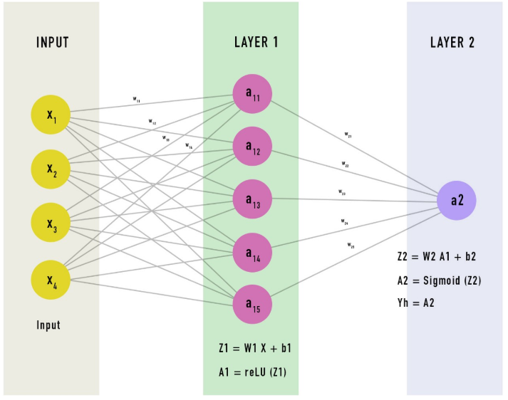

Основы
======

**Алгоритм** - это любая корректно определенная вычислительная процедура, на **вход** которой подается некоторая величина или набор величин и результатом выполнения которой является выходная величина или набор значений.

Алгоритм **корректен**, если для любых входных данных результатом его работы являются корректные выходные данные.

**Структура данных** - это способ хранения и организации данных, облегчающий доступ к этим данным и их модификацию.

Анализ алгоритмов
=================

**Размер входных данных** - зависит от рассматриваемой задачи:
- **количество входных элементов** - размер сортируемого массива;
- **общее количество бит**;
- **количество вершин и ребер графа**;
- и др.

**Время работы** - измеряется в количестве элементарных операций, или "шагов", которые необходимо выполнить.

Время работы алгоритма - это сумма промежутков времени, необходимых для выполнения каждой входящей в его состав выполняемой инструкции. Даже если размер входных данных является фиксированной величиной, время работы алгоритма может зависеть от самих входных данных - от степени упорядоченности величин.

**Скорость роста** (**порядок роста**) - это главный член формулы времени работы алгоритма, без постоянного множителя приглавном члене:  
`a[i] * n ^ i + a[i - 1] * n ^ (i - 1) + ... + a[0] * n ^ 0` будет равен `Θ(n ^ i)` ("тета от `n` в степени `i`")

## `Θ` ("тета от ...") асимптотическая граница сверху и снизу

Для заданой функции `g(n)` запись `Θ(g(n))` обозначает множество функций:  
`Θ(g(n)) = {f(n)` `:` (такие, что / для которых выполняется условие) существуют положительные константы `c1`, `c2` и `n0`, такие, что `0 <= c1 * g(n) <= f(n) <= c2 * g(n)` для всех `n >= n0` `}`.

`f(n) = Θ(g(n))`

Функция `g(n)` является **асимптотически точной оценкой** функции `f(n)`.

## `O` ("o большое от ...") асимптотическая верхняя граница

Для заданой функции `g(n)` запись `O(g(n))` обозначает множество функций:  
`O(g(n)) = {f(n)` `:` (такие, что / для которых выполняется условие) существуют положительные константы `c` и `n0`, такие, что `0 <= f(n) <= c * g(n)` для всех `n >= n0` `}`.

`f(n) = O(g(n))`

## `Ω` ("омега от ...") асимптотическая нижняя граница

Для заданой функции `g(n)` запись `Ω(g(n))` обозначает множество функций:  
`Ω(g(n)) = {f(n)` `:` (такие, что / для которых выполняется условие) существуют положительные константы `c` и `n0`, такие, что `0 <= c * g(n) <= f(n)` для всех `n >= n0` `}`.

`f(n) = Ω(g(n))`

## `o` ("o малое от ...") верхний предел, не являющийся асимптотически точной оценкой функции

Для заданой функции `g(n)` запись `o(g(n))` обозначает множество функций:  
`o(g(n)) = {f(n)` `:` (такие, что / для которых выполняется условие) для любой положительной константы `c > 0` существует константа `n0 > 0`, такая, что `0 <= f(n) < c * g(n)` для всех `n >= n0` `}`.

`f(n) = o(g(n))`

## `ω` ("омега малое от ...") нижний предел, не являющийся асимптотически точной оценкой функции

Для заданой функции `g(n)` запись `ω(g(n))` обозначает множество функций:  
`ω(g(n)) = {f(n)` `:` (такие, что / для которых выполняется условие) для любой положительной константы `c > 0` существует константа `n0 > 0`, такая, что `0 <= c * g(n) < f(n)` для всех `n >= n0` `}`.

`f(n) = ω(g(n))`

## Трихотомия

Для любых двух действительных чисел `a` и `b` должно выполняться только одно из соотношений `a < b`, `a = b` и `a > b`.

## Стандартные обозначения и часто встречающиеся функции

### Монотонность

Функция `f(n)` является:
- **монотонно не убывающей**, если из `m <= n` вытекает `f(m) <= f(n)`;
- **монотонно не возрастающей**, если из `m <= n` вытекает `f(m) >= f(n)`;
- **монотонно возрастающей**, если из `m < n` вытекает `f(m) < f(n)`;
- **монотонно убывающей**, если из `m < n` вытекает `f(m) > f(n)`.

### Полы и потолки

Для любого действительного числа `x` обозначим наибольшее целое число, меньшее или равное `x`, как `⌊x⌋` (читается как "пол (floor) `x`"), а наименьшее целое число, большее или равное `x`, - как `⌈x⌉` (читается как "потолок (ceil) `x`") для всех действительных `x`  
`x - 1 < ⌊x⌋ <= x <= ⌈x⌉ < x + 1`

Для любого целого `n`  
`⌈n / 2⌉ + ⌊n / 2⌋ = n`

### Модульная арифметика

Для любого целого числа `a` и любого натурального `n` величина `a mod n` представляет собой **остаток** от деления `a` на `n`:  
`a mod n = a - n * ⌊a / n⌋` следует что  
`0 <= a mod n < n`

`(a mod n) = (b mod n)` - `a ≡ b (mod n)` - число `a` **эквивалентно**, или **равно**, числу `b` по модулю `n`.

### Полином

Для любого неотрицательного целого `d` полиномом степени `d` от аргумента `n` называется функция:  
`p(n) = (ad * n ^ d) + (a(d - 1) * n ^ (d - 1)) + ... + (ai * n ^ i) + ... + (a0 * n ^ 0)`  
`p(n) = Ʃ(ai * n ^ i)` от `0` и до `d` - где константы `a0`, `a1`, ..., `ad` - коэффициенты полинома и `ad != 0`

### Показательная функция

Для всех действительных чисел `a > 0`, `m` и `n` справедливы следующие тождества:
- `a ^ 0 = 1`;
- `a ^ 1 = a`;
- `a ^ -1 = 1 / a`;
- `(a ^ m) ^ n = a ^ (m * n)`;
- `(a ^ m) ^ n = (a ^ n) ^ m`;
- `a ^ m * a ^ n = a ^ (m + n)`;
- `0 ^ 0 = 1`.

`e ^ x = Ʃ(x ^ i / x!)` от `0` и до `∞`  
`e ^ x >= 1 + x`  
`1 + x <= e ^ x <= 1 + x + x ^ 2` - когда `|x| <= 1`

### Логарифм

`lg n = log(2) n` - бинарный логарифм.  
`ln n = log(e) n` - натуральный логарифм.  
`lg ^ k n = (lg n) ^ k` - возведение в степень.  
`lg lg n = lg (lg n)` - композиция.

Для всех действительных `a > 0`, `b > 0`, `c > 0` и `n`:
- `a = b ^ log(b) a`;
- `log(c) (a * b) = log(c) a + log(c) b`;
- `log(b) a ^ n = n * log(b) a`;
- `log(b) a = log(c) a / log(c) b`;
- `log(b) (1 / a) = - log(b) a`;
- `log(b) a = 1 / log(a) b`;
- `a ^ log(b) c = c ^ log(b) a`.

Где основание логарифма не равно 1.

### Факториал (`n!`)

`n! = 1`, если `n = 0`,  
`n! = n * (n - 1)!`, если `n > 0`.

### Функциональная итерация

Запись `f ^ (i)(n)` используется для обозначения функции `f(n)`, итеративно примененной `i` раз к исходному значению `n`:

`f ^ (i)(n) = n`, если `i = 0`,  
`f ^ (i)(n) = f(f ^ (i - 1)(n))`, если `i > 0`.

Разработка алгоритмов
=====================

## Метод декомпозиции (разделяй и властвуй)

Этот алгоритм использует **рекурсивную структуру** - для решения поставленной задачи они рекурсивно вызывают сами себя один раз или несколько раз решая вспомогательные подзадачи, тесно связанные с основной подзадачей.

Сложная задача разбивается на несколько простых подзадач, которые подобны исходной задаче, но имеют меньший объем; далее эти вспомогательные задачи решаются рекурсивным методом, после чего полученные решения комбинируются для получения решения исходной задачи. Состоит из шагов:
- **Разделение задачи** на несколько подзадач, которые представляют собой меньшие экземпляры той же задачи;
- **Властвование над подзадачами** путем их рекурсивного решения;
- **Комбинирование** решений подзадач в решение исходной задачи.

Время работы можно описать с помощью **рекуррентного уравнения** (**рекуррентности**) которое выражает полное время, требующееся для решения всей задачи размером `n`, через время решения задач для меньших входных данных.

`T(n)` - время решения задачи, размер которой равен `n`. То тогда:
- `T(n) = Θ(1)` если `n <= c` для некоторой заранее известной константы `c`;
- `T(n) = a * T(n / b) + D(n) + C(n)` в противном случае, где:
    - `a` - количество подзадач на которые делится задача, объем каждой из которых равен `1 / b` от объема исходной задачи;
    - `T(n / b)` - время нужное для решения подзадачи размером `n / b`, а `a * T(n / b)` - время нужное для решения `a` таких подзадач;
    - `D(n)` - время нужное для разбивания задачи на вспомогательные подзадачи;
    - `C(n)` - время нужное для объединения решений подзадач в решение исходной задачи.

Виды алгоритмов
===============

## Разделяй и властвуй

Алгоритмы этим методом состоят из шагов:
1. Определение базовых случаев - простейших случаев из всех возможных;
2. Деление или сокращение базовой задачи до тех пор, пока она не будет сведена к базовому случаю.

## Жадные алгоритмы

Это когда на каждом шаге выбирается локально-оптимальное решение и в результате получается глобально-оптимальное решение.

## Динамическое программирование

Используется когда нужно максимизировать какую-то характиристику с помощью построения таблицы, в каждой ячейке которой решается подзадача, на основании имеющихся характеристик и данных в таблице, которая заполняется построчно по формуле:
`cell[i][j]` = формула по решению подзадачи по оптимизации, где `i` - строка, `j` - столбец; или `cell[i][j]` = максимум из:
1. предыдущий максимум (значение в ранее заполненных ячейках таблицы);
2. новое значени вычесленной по формуле оптимизации.

## Регресия

Это прогнозирование ответа на основании метода "k-ближайших соседей" с помощью выбора по текущим признакам ближайших соседей.

Алгоритмы сортировки
====================

**Инвариант цикла** - логическое выражение, истинное после каждого прохода тела цикла (после выполнения фиксированного оператора) и перед началом выполнения цикла, зависящее от переменных, изменяющихся в теле цикла. Должны обладать следующими свойствами:
1. **Инициализация** - должны быть справедливы перед первой итерацией цикла;
2. **Сохранение** - если они истинны перед очередной итерацией цикла, то остаются истинны и после нее;
3. **Завершение** - по завершению цикла инварианты позволяют убедиться в правильности алгоритма.

## Сортировка вставкой

Алгоритм сортирует входные числа на месте, без привлечения дополнительной памяти.

Время работы `Θ(n ^ 2)`.

```псевдокод
IntentionSort(A) // A[1..n] массив, содержащий последовательность длиной n, обозначаемой A.length
    for j = 2 to A.length
        key = A[j]
        // вставка A[j] в отсортированную последовательность A[1..j - 1]
        i = j - 1
        while i > 0 и A[i] > key
            A[i + 1] = A[i]
            i = i - 1
        A[i + 1] = key

IntentionSort(A)
```

```javascript
    function insertionSort(A) {
        for (let j = 1; j < A.length; j++) {
            const key = A[j];
            let i = j - 1;
            while (i >= 0 && A[i] > key) {
                A[i + 1] = A[i];
                i = i - 1;
            }
            A[i + 1] = key;
        }
    }

    arr = [5, 2, 4, 6, 1, 3];
    insertionSort(arr);
    console.log(arr);
```

## Сортировка слиянием

Время работы `Θ(n * lg(n))`.

```псевдокод
Merge(A, p, q, r) // A[1..n] массив, содержащий последовательность длиной n, обозначаемой A.length, а p, q, r - индексы, нумерующие элементы массива, такие что p <= q <= r
    n1 = q - p + 1
    n2 = r - q
    Пусть L[1..n1 + 1] и R[1..n2 + 1] - новые массивы
    for i = 1 to n1
        L[i] = A[p + i - 1]
    for j = 1 to n2
        R[j] = A[q + j]
    L[n1 + 1] = ∞
    R[n2 + 1] = ∞
    i = 1
    j = 1
    for k = p to r
        if L[i] <= R[j]
            A[k] = L[i]
            i = i + 1
        else A[k] = R[j]
            j = j + 1

MergeSort(A, p, r)
    if p < r
        q = ⌊(p + r) / 2⌋ // ⌈x⌉ наименьшее целое число, которое больше или равно x, а выражение ⌊x⌋ наименьшее целое число, которое меньше или равно x
        MergeSort(A, p, q)
        MergeSort(A, q + 1, r)
        Merge(A, p, q, r)

MergeSort(A, 1, A.length)
```

```javascript
    function merge(A, p, q, r) {
        const n1 = q - p + 1;
        const n2 = r - q;
        const L = new Array(n1 + 1);
        const R = new Array(n2 + 1);

        for (let i = 0; i < n1; i++) {
            L[i] = A[p + i];
        }
        for (let j = 0; j < n2; j++) {
            R[j] = A[q + j + 1];
        }
        L[n1] = Infinity;
        R[n2] = Infinity;
        let i = 0;
        let j = 0;
        for (let k = p; k <= r; k++) {
            if (L[i] <= R[j]) {
                A[k] = L[i];
                i = i + 1;
            } else {
                A[k] = R[j];
                j = j + 1;
            }
        }
    }

    function mergeSort(A, p, r) {
        if (p < r) {
            const q = Math.floor((p + r) / 2);
            mergeSort(A, p, q);
            mergeSort(A, q + 1, r);
            merge(A, p, q, r);
        }
    }

    arr = [5, 2, 4, 6, 1, 3];
    mergeSort(arr, 0, arr.length - 1);
    console.log(arr);
```

## Пузырьковая сортировка

Время работы `Θ(n ^ 2)`.

```псевдокод
BubbleSort(A) // A[1..n] массив, содержащий последовательность длиной n, обозначаемой A.length
    for i = 1 to A.length - 1
        for j = A.length downto i + 1
            if A[j] < A[j - 1]
                поменять A[j] и A[j - 1] местами
```

```javascript
    function bubbleSort(A) {
        for (let i = 0; i < A.length - 1; i++) {
            for (let j = A.length - 1; j > i; j--) {
                if (A[j] < A[j - 1]) {
                    const k = A[j];
                    A[j] = A[j - 1];
                    A[j - 1] = k;
                }
            }
        }
    }

    arr = [5, 2, 4, 6, 1, 3];
    bubbleSort(arr);
    console.log(arr);
```

Нейронные сети
==============

**Нейронная сеть** - цепочка функций, линейных и нелинейных, которые вместе образуют сложную функцию, которая свяжет входные данные с желаемым результатом.

**Нейрон** - это структурная единица - функция, которая принимает массив признаков (значений) и которая возвращает результат в виде нового значения.

Состоит из слоев:
- **входной слой** - содержит исходные данные в виде нейронов, которые ничего не принимают, а только возвращают данные. Количество нейронов совпадает с количеством признаков;
- **промежуточные слои** - один или более скрытых слоев, которые содержат нейроны, которые принимают признаки из предыдущих слоев или из входного слоя, в случае первого, и возвращает новые данные в другой слой;
- **финальный слой** - содержит 1 нейрон - выход сети.



Где:
- `X` - входной слой с данными;
- `Y` - выходной слой, который соответствует входу `Х`. Результат, который должны получить в конце работы сети;
- `Yh` - предсказание, результат, который получат, после того, как передадут `Х` сети;
- `W` - веса сети;
- `b` - коэффициент смещения нейронов.

Каждый нейрон в текущем слое соединен с каждым нейроном в предыдущем слое. Новое значение каждого нейрона в текущем слое равно сумме результатов умножения значения каждого предыдущего нейрона на вес связи между предыдущим нейроном и текущим нейроном.

**Взвешенная сумма** - `Z = Ʃ(W * X + b)`.

Градиент функции в точке также называется ее производной и выражает скорость изменения значения функции в этой точке. Бывают:
- **исчезающий градиент** - когда градиенты (производные) становятся слишком маленькими, а функция становится более гладкой;
- **взрывающийся градиент** - значение градиента становится слишком большим, а функция становится более резкой.

**Функция активации** - это нелинейная функция, которая вносит нелинейные изменения в выход (результат вычислений) слоя. Она гарантирует, что сеть способна вычислить всевозможные сложные функции, включая очень сильно нелинейные. Бывают:
- **Sigmoid** - *Сигмоида* - `1 / (1 + e ^ (-x))`. Особености:
    - возвращает значения в диапазоне от 0 до 1;
    - нелинейная, она "толкает" аргументы функции к крайним значениям своего диапазона;
    - имеет гладкую форму, так что ее градиент будет вполне контролируемым;
    - подходит для разбивания на 2 класса;
    - полезна, когда она является функцией активации нейронов на последнем слое, потому что она приводит выходной сигнал к 0 или 1.
- **Tanh** - *Гиперболический тангенс* - `2 / (1 + e ^ (-2 * x)) - 1`. Особености:
    - возвращает значения в диапазоне от -1 до 1;
    - аналогично сигмоиде, только увеличенная версия.
- **ReLU** - *rectified linear unit* - `max(0, x)`. Особености:
    - выход равен входу, если значение больше 0;
    - принимает значения в диапазоне от 0 до бесконечности. Это значит, потенциально выходное значение может быть очень большим. Могут быть проблемы с взрывающимся градиентом;
    - значение вычисляется очень легко;
    - наиболее используемая функция активации на внутренних слоях.
- **Softmax** - `e ^ x / Sum(e ^ x)`. Где `Sum(e ^ x)` - сумма всех выходов `e ^ x` Особености:
    - возвращает значения в диапазоне от 0 до 1;
    - нормализует вход в распределение вероятностей. Она сжимает входной сигнал в диапазон от 0 до 1, как и сигмоида, но также она еще и делит результат на сумму всех выходов, поэтому сумма всех выходных сигналов будет равняться 1;
    - обычно эта функция используется на последнем слое, когда нужно сделать классификацию не несколько классов. Softmax будет гарантировать, что значение суммы вероятностей, связанных с каждым классом, всегда будет равняться 1.

`А = <функция_активации>(Z)` - представляет выходной сигнал функции активации.

Другие алгоритмы
================

## Алгоритм создания всех наборов элементов

```ts
function makeSequences<T>(itemSets: T[][]): Iterable<T[]> {
    const positions = itemSets.map(() => 0).concat(0);
    positions[0] = -1;

    return {
        [Symbol.iterator](): Iterator<T[]> {
            return {
                next(): IteratorResult<T[]> {
                    if (positions[positions.length - 1] === 0) {
                        positions[0] += 1;
                        for (let i = 0; i < positions.length - 1; i++) {
                            if (positions[i] >= itemSets[i].length) {
                                positions[i + 1] += 1;
                                positions[i] = 0;
                            }
                        }
                    }
                    if (positions[positions.length - 1] === 1) {
                        return {
                            done: true,
                            value: undefined,
                        };
                    }

                    return {
                        done: false,
                        value: itemSets.map((itemSet, i) => itemSet[positions[i]]),
                    };
                }
            };
        },
    };
}

for (const seq of makeSequences([[1, 2, 3], [1, 2]])) {
    console.log('seq', seq);
}
```

## Алгоритм Леванштейна

```ts
type Action = 'delete' | 'replace' | 'add' | 'match';

function correct<I, O>(arrI: I[], arrO: O[], isEqual: (a: I, b: O) => boolean, costs: Record<Action, number>): Action[] {
    const matrix: number[][] = Array.from({length: arrO.length + 1}, () => new Array(arrI.length + 1).fill(0));
    for (let i = 1; i < arrO.length + 1; i++) {
        matrix[i][0] = matrix[i - 1][0] + costs['delete'];
    }
    for (let j = 1; j < arrI.length + 1; j++) {
        matrix[0][j] = matrix[0][j - 1] + costs['add'];
    }
    for (let i = 1; i < arrO.length + 1; i++) {
        for (let j = 1; j < arrI.length + 1; j++) {
            matrix[i][j] = Math.min(
                matrix[i - 1][j] + costs['delete'],
                matrix[i][j - 1] + costs['add'],
                matrix[i - 1][j - 1] + (isEqual(arrI[j - 1], arrO[i - 1]) ? costs['match'] : costs['replace']),
            );
        }
    }

    const actions: Action[] = [];
    
    for (let i = arrO.length, j = arrI.length; i !== 0 || j !== 0;) {
        const currentCost = matrix[i][j];
        const deleteCost = j - 1 >= 0 ? matrix[i][j - 1] + costs['delete']: Number.POSITIVE_INFINITY;
        const addCost = i - 1 >= 0 ? matrix[i - 1][j] + costs['add'] : Number.POSITIVE_INFINITY;
        const replaceCost = i - 1 >= 0 && j - 1 >= 0 ? matrix[i - 1][j - 1] + costs['replace'] : Number.POSITIVE_INFINITY;
        if (deleteCost < addCost && deleteCost < replaceCost) {
            j -= 1;
            actions.unshift('delete');
            continue;
        }
        if (addCost < replaceCost) {
            i -= 1;
            actions.unshift('add');
            continue;
        }
        i -= 1;
        j -= 1;
        if (currentCost + costs['replace'] === replaceCost) {
            actions.unshift('match');
        } else {
            actions.unshift('replace');
        }
    }

    return actions;
}

const actions = correct('polynomial'.split(''), 'exponential'.split(''), (a, b) => a === b, {
    delete: 1,
    replace: 1,
    add: 1,
    match: 0,
});

console.log(actions);
```

## Отложеный вызов

```ts
function throttle<A extends unknown[], T>(fn: (...args: A) => void, delay: number, ctx: T): (...args: A) => void {
    let timer: number | undefined;
    let lastArgs: A | undefined;
    const func = (...args: A): void => {
        if (timer) {
            lastArgs = args;
            return;
        }
        lastArgs = undefined;
        fn.apply(ctx, args);
        timer = setTimeout(() => {
            timer = undefined;
            if (lastArgs) {
                func(...lastArgs);
            }
        }, delay);
    };
    return func;
}
```

## Параллельное выполнение

```ts
function parallel<T, R>(array: T[], predicat: (item: T, index: number, array: T[]) => Promise<R>, limit: number): Promise<R[]> {
    return new Promise((res) => {
        const output: R[] = [];
        let position = 0;

        const next = () => {
            if (position < array.length) {
                const index = position;
                position += 1;
                predicat(array[index], index, array).then((result) => {
                    console.log('finished', index);
                    output[index] = result;
                    next();
                });
                return;
            }
            if (Object.keys(output).length === array.length) {
                res(output);
            }
        };

        for (let i = 0; i < limit; i++) {
            next();
        }
    });
}
```
